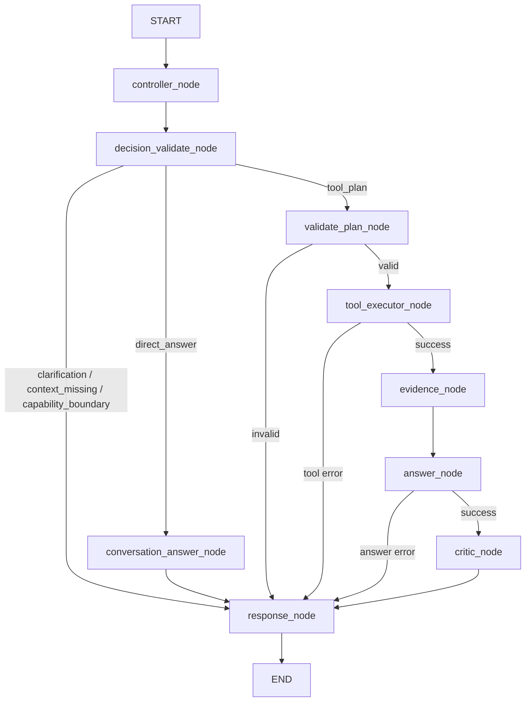

# DotaMind V3 Node / Tool / Edge Inventory

This document records the current single-path Controller architecture. It must
stay aligned with `/api/v1/plan` and `/debug/plan`.

## Runtime Shape



No node routes on `intent`. Only `decision.kind`, validated `tool_calls`, the
output contract, effective evidence and runtime status influence execution.

## Node Inventory

| Node | Responsibility | Tool/Evidence behavior |
|---|---|---|
| `controller_node` | Ask the LLM for one discriminated `ControllerDecision`; apply sample policy to a tool plan before first deterministic plan validation. | No tool execution. |
| `decision_validate_node` | Repeat shared deterministic decision/basis/plan validation without mutating the decision. | Recomputes and refreshes authoritative evidence obligations in state. |
| `conversation_answer_node` | Read only validated `Turn` basis and render recall templates or an approved social answer. | Never creates EvidenceGraph. |
| `validate_plan_node` | Validate final args, references, contract and effective evidence producibility. | Never applies policy or modifies evidence. |
| `tool_executor_node` | Resolve plan-local references and execute registered tools. | Failure routes directly to response. |
| `evidence_node` | Run tool-owned extractors and compute missing effective evidence and data quality. | Tool-plan branch only. |
| `answer_node` | Produce structured or natural-language answers from EvidenceGraph. | Tool-plan branch only. |
| `critic_node` | Review missing/quality/mock/confidence constraints. | Tool-plan branch only. |
| `response_node` | Apply deterministic status priority and serialize the public response. | Never serializes `state.history`. |

## Decision Inventory

| `decision.kind` | Meaning | Terminal mapping |
|---|---|---|
| `direct_answer` | Conversation recall or social response. | `ok/direct_answer` |
| `clarification` | Fixed-enum user input is missing. | `clarification_required/clarification` |
| `context_missing` | Requested conversation context is unavailable. | `insufficient_context/conversation_context_missing` |
| `capability_boundary` | Registered tools cannot satisfy the request. | `insufficient_tools/capability_boundary` |
| `tool_plan` | At least one registered tool call is required. | Full evidence pipeline or explicit error/insufficient evidence. |

`DirectAnswerDecision` recall modes use `ConversationBasis` pointing to a
current-session `Turn.query`, successful `resolved_entities`, or a non-redacted
`response_summary`. Historical IDs are never accepted as current tool evidence.

## Tool Contract Inventory

Every `ToolDefinition` declares input schema, accepted references, output paths,
source, evidence extractor, producible evidence kinds and primary mandatory
evidence. Startup validation rejects inconsistent registry metadata.

Contract and model-requested evidence remain global kind obligations. Registry
mandatory evidence is an obligation for each successful `tool_call_id`. The
EvidenceGraph groups extracted evidence by call, so two calls of the same tool
cannot borrow one another's primary evidence.

| Tool | Mandatory evidence |
|---|---|
| `resolve_hero` | `hero_identity` |
| `stratz.pair_lane_outcome` | `pair_lane_winrate` |
| `stratz.hero_matchup_ranking` | `matchup_ranking_row` |
| `stratz.hero_synergy_ranking` | `hero_synergy_ranking_row` |
| `stratz.lane_meta_global` | `lane_meta_row` |
| `stratz.hero_position_stats` | `position_stat` |
| `stratz.hero_daily_trends` | `hero_daily_trend` |
| `stratz.filter_heroes_by_position` | `role_filtered_candidate_row` |
| `stratz.player_profile` | `player_identity` |
| `stratz.player_recent_matches` | `player_recent_summary` |
| `stratz.player_hero_performance` | `player_hero_performance` |
| `opendota.resolve_team` | `team_identity` |
| `opendota.team_recent_matches` | `recent_matches` |
| `opendota.team_players` | `current_players` |
| `opendota.team_heroes` | `team_hero_usage` |
| `opendota.hero_stats_by_role` | `hero_stats` |
| `patch.get_records` | `patch_records` |
| `patch.hero_changes` | `hero_patch_changes` |
| `patch.item_changes` | `item_patch_changes` |

`sample_size` remains a normally extracted quality signal, not a universal
mandatory kind in this release.

## Contract Inventory

| Contract | Route | Contract evidence |
|---|---|---|
| `natural_language_answer` | natural language | none by default |
| `patch_impact_report` | structured | `patch_records` |
| `role_meta_report` | structured | `hero_stats` |
| `team_recent_report` | structured | `team_identity`, `recent_matches` |

Effective evidence is the sorted union of contract evidence, selected-tool
mandatory evidence and model-requested evidence. `required_evidence_sources`
uses stable `contract:<name>`, `tool:<name>`, and `planner` labels.

## Error Edges

Top-level mapping is deterministic:

```text
planning_error
  > decision_validation_error
  > tool_error
  > answer_error
  > insufficient_evidence from missing evidence
  > insufficient_evidence from critic quality failure
  > success
```

The ordering means `tool_error` wins when the same failure also causes missing
evidence, and `answer_error` wins over a critic-quality failure. Reference
resolution failures create failed ToolResults; other unclassified runtime
errors map to `execution_error`.

## Explicitly Out of Scope

- raw user/assistant message persistence;
- LangGraph checkpointer state;
- a second LLM judge for free Controller text;
- freshness or universal sample-size policy;
- fixed intent pipelines or a legacy/fallback graph;
- compatibility endpoints or a separate frontend.
