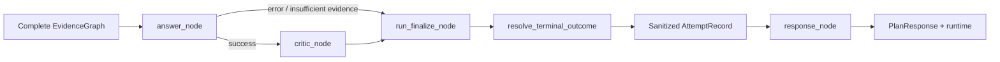

# Answer + Critic 层工作链路详解

> 本文描述 DotaMind v2.5 架构中的 Answer 与 Critic 层。Answer 层把 EvidenceGraph 转成面向用户的回答；Critic 层对回答和证据进行规则审查。两者共同决定最终响应是否可信，但不执行工具、不补证据。

## 1. 层定位

Answer + Critic 位于 EvidenceGraph 之后：

```text
evidence_node
  -> answer_node
  -> AnswerSynthesizer
  -> AgenticCritic
  -> response_node
```

Answer 负责生成回答，Critic 负责审查回答是否被证据充分支撑。

## 2. Answer 输入与输出

Controller 与 Natural Language Answer 是两次独立的 LLM 调用。工具执行和 EvidenceGraph
构建位于两次调用之间；当前用户原话同时通过一条旁路直接传给 Answer，避免 Controller
在重建 `plan.goal` 时压缩掉“只回答某项”“不要天赋”“返回前 N 个”等展示要求：

```text
用户请求
   │
   ├────────────────────────────────────────────┐
   ▼                                            │
Controller LLM                                  │ 原文 current_query 旁路保留
   │                                            │
   ▼                                            │
ControllerDecision / ExecutionPlan              │
   │                  │                         │
   │                  └── reconstructed_goal ─┐ │
   ▼                                          │ │
ToolExecutor（非 LLM）                          │ │
   │                                          │ │
   ▼                                          │ │
EvidenceGraph ──────────────────────────────┐  │ │
                                            ▼  ▼ ▼
                                          Answer LLM
                                              │
                                              ▼
                                           最终回答
```

这条旁路只补充请求的展示语义，不绕过 Controller 决策，也不扩大 EvidenceGraph 的事实
边界。如果 Controller 返回 `direct_answer`，流程会直接结束，不调用工具或 Answer LLM。

Answer 输入：

- `ExecutionPlan`
- `EvidenceGraph`
- 当前用户原话 `state.query`（仅自然语言 Answer）

Answer 输出：

```python
AnswerSynthesisResult(
    answer_type=plan.output_contract,
    status="ok" | "insufficient_evidence" | "unsupported_output_contract" | "error",
    summary="...",
    claims=[...],
    recommendations=[...],
    limitations=[...],
    data_notes=[...],
    confidence=0.0..1.0,
)
```

`answer_node` 不直接解释工具结果；它调用
`AnswerSynthesizer.synthesize(plan, graph, current_query=state.query)` 并把结果写入
`state.answer`。Structured Answer 不消费该字段；自然语言 Answer 用它恢复最新展示措辞。

## 3. Answer 路由

`AnswerSynthesizer` 根据 `output_contract` 路由：

```text
if output_contract in STRUCTURED_OUTPUT_CONTRACTS:
  -> StructuredReportSynthesizer

elif output_contract == natural_language_answer:
  -> NaturalLanguageAnswerSynthesizer

else:
  -> unsupported_contract
```

当前 structured contract 包括：

- `patch_impact_report`
- `role_meta_report`
- `team_recent_report`

自然语言 contract 用于 draft/counter/lane 等尚未结构化的组合型回答。

## 4. Structured Answer 链路

Structured synthesizer 是规则型，不调用 LLM。

典型流程：

```text
plan.output_contract
  -> select handler
  -> read required EvidenceItem
  -> if missing: insufficient_evidence
  -> build claims/recommendations/limitations
  -> compute data_notes/confidence
```

例如 `team_recent_report` 需要：

- `team_identity`
- `recent_matches`

缺失时返回：

```text
status = "insufficient_evidence"
limitations = missing evidence notes
```

Structured answer 的优点是稳定、可测；缺点是每个 contract 都需要手写规则。

## 5. Natural Language Answer 链路

Natural language answer 调用 LLM，并同时提供请求语义与 EvidenceGraph：

```text
system:
  Use only the provided evidence graph. Do not invent stats.

user:
  request_context={
    current_query: <当前用户原话>,
    reconstructed_goal: <plan.goal>
  }
  required_evidence=<plan.required_evidence>
  evidence_graph=<graph JSON>
```

`current_query` 保留当前消息中的具名焦点、排除项、数量和细节要求；
`reconstructed_goal` 承接 Controller 从多轮会话恢复的完整请求。两者只影响展示范围，
不得扩大 EvidenceGraph 中可陈述的事实。该方案不新增固定 presentation 枚举或 intent 路由。

自然语言 Answer 的静态 system prompt 和上述消息形状由
`agentic/prompts/answer.py` 的 renderer 负责；`answer/synthesizer.py` 负责选择
LLM、执行同步/流式调用和包装结果，不内嵌 prompt 文本。

当前系统提示还要求：

- 如果 evidence 不足，说明缺什么。
- 当 evidence 带 `week_index/week_epoch` 时，跨周比较并说明趋势。
- 如果某个请求周没有样本，明确说明。
- 对 `pair_lane_outcome`，分别说明对线赢/平/输率与整局胜率；默认一周只代表
  当前查询窗口，不代表系统只能查询一周。位置以 evidence 的
  `filters.position_ids` 为准，不能解释 provider row 的 `position`。
- 只有用户请求 Catalog-backed 的英雄、技能、天赋或物品定义时，才披露 Catalog
  evidence 携带的 patch/generated_at。STRATZ 统计回答即使同时有 hero_identity
  Catalog evidence，也不得披露或把 Catalog 元数据标为统计补丁、统计快照或统计版本。
- 不得仅因整局胜率与对线胜率不同，就推断中后期强势、翻盘能力或比赛阶段的因果解释；
  无明确证据时只报告统计差异，任何解释必须明确标为假设。

LLM 的输出只填入 `summary`；结构化的 `claims` 和 `recommendations` 当前不从自然语言输出中反解析。

## 6. Answer Data Notes

所有 answer 都会附带 data notes：

- `evidence_completeness`
- `minimum_sample_size`
- `mock_source_detected`

这些来自 EvidenceGraph 的 `data_quality`，用于告诉用户回答的数据基础。

## 7. Confidence 计算

当前 confidence 是规则计算：

```text
base = graph.data_quality.completeness
if mock_used:
  cap at 0.2
if min_sample_size exists:
  cap/raise within sample-based range
if no output:
  cap at 0.35
```

它不是模型自评，而是基于证据覆盖、样本量和 mock 状态的保守分数。

## 8. Critic 输入与输出

Critic 输入：

- `ExecutionPlan`
- `EvidenceGraph`
- `AnswerSynthesisResult`

Critic 输出：

```python
AgenticCriticReview(
    passed=True | False,
    severity="pass" | "warning" | "failed",
    reasons=[...],
    metadata={...}
)
```

`critic_node` 把 review 写入 `state.review`，然后进入 response node。

## 9. Critic 审查链路

`AgenticCritic.review()` 依次收集 issues：

```text
_missing_evidence_issues
_mock_issues
_tool_failure_issues
_answer_status_issues
_confidence_issues
```

然后聚合：

```text
if any failed:
  severity = failed
  passed = false

elif any warning:
  severity = warning
  passed = true

else:
  severity = pass
  passed = true
```

## 10. Critic 检查项

缺失证据：

```text
if graph.missing:
  failed
```

Mock source：

```text
if graph.data_quality.mock_used and not plan.constraints.allow_mock:
  failed
```

工具失败：

```text
if any ToolResult.status == "error":
  failed
```

Answer status：

```text
if answer.status != "ok":
  failed
```

Confidence：

```text
if confidence < hard_min_confidence:
  failed
elif confidence < min_confidence:
  warning
```

## 11. Response Node

V3.2-1 将终态归约与公开序列化分开：



`run_finalize_node` 负责唯一一次终态归约和 Attempt 收口；Response node 只接受已
finalized state，并统一序列化最终状态：

```text
query
game
status
reason
response_type
plan
tool_results
evidence_graph
answer
review
errors
trace
runtime
```

Planner raw output、Prompt messages、history、原始 validation/retry 内容不会进入公开
响应。

`response_type` 已由 `resolve_terminal_outcome()` 确定：

- `capability_boundary`
- `execution_error`
- `raw_tool_results`
- `insufficient_evidence`
- `answer_error`
- output contract name
- `unsupported_answer`

这让 debug UI 可以同时看到计划、工具、证据、回答、审查结果，以及 Run、Budget、
单 Attempt 和带耗时的 Trace。Response node 不再保留第二套终态判断逻辑。

## 12. 失败路径

```text
缺 plan 或 graph
  -> answer_node error

structured answer 缺 required evidence
  -> insufficient_evidence
  -> critic failed

natural answer LLM disabled
  -> answer error
  -> critic failed

natural answer LLM exception
  -> answer error
  -> critic failed

evidence missing/tool failed/mock used
  -> critic failed
```

Critic 不会重试 LLM，也不会新增工具调用。它只给出审查结论。

## 13. 层边界

Answer 层负责：

- 将 EvidenceGraph 转换为用户可读回答。
- 选择 structured 或 natural-language route。
- 暴露 limitations、data_notes、confidence。
- 在周 bucket evidence 存在时描述趋势。

Answer 层不负责：

- 执行工具。
- 伪造缺失 evidence。
- 修改 plan。
- 隐藏 tool failure。

Critic 层负责：

- 检查 evidence completeness。
- 检查 tool failure。
- 检查 mock usage。
- 检查 answer status 和 confidence。

Critic 层不负责：

- 生成回答。
- 自动 replan。
- 自动补工具。
- 把失败改成成功。

## 14. 后续扩展方向

可扩展点：

- 为更多 output contract 增加 structured synthesizer。
- 将 answer caveat 规则从 prompt 下沉到可测规则。
- 增加 per-intent quality policy。
- 增加 critic retry hint，但仍需限制 replan 次数。
- 对 STRATZ weekly bucket 增加稳定的趋势模板，减少自然语言漂移。

