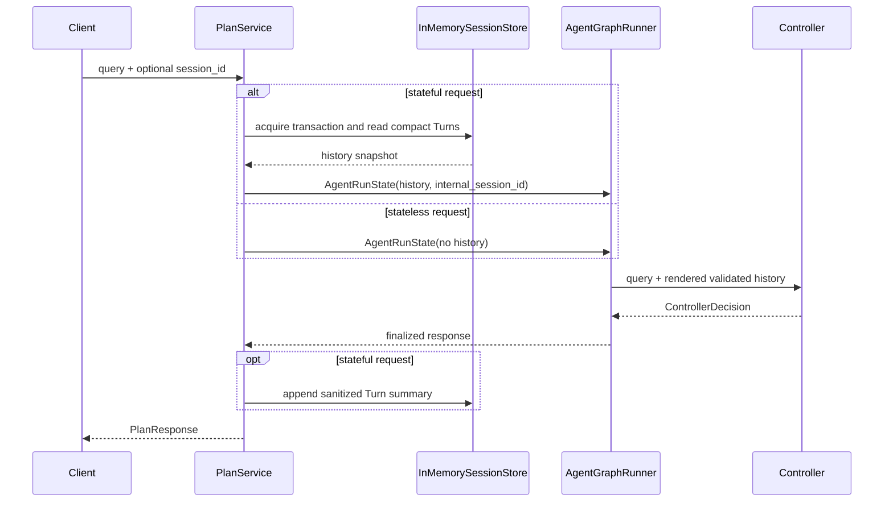

# Controller 层

Controller 是 `/api/v1/plan` 唯一的 LLM 控制入口。它不要求每轮都生成
`ExecutionPlan`，而是返回一个带 discriminator 的 `ControllerDecision`。
所有 LLM-facing decision/basis model 都使用 `extra="forbid"`，混合结构和
未知字段会进入结构化 retry，而不会被静默丢弃。

## 决策契约

```text
direct_answer
clarification
context_missing
capability_boundary
tool_plan(plan: ExecutionPlan)
```

`intent` 只记录用户目标语义，不参与 Graph 路由。`tool_plan` 不重复保存
intent，直接读取 `plan.intent`。

## 候选处理顺序

```text
LLM JSON
  -> Pydantic ControllerDecision parse
  -> normalize basis / missing_fields
  -> tool_plan: apply_sample_policy(plan) exactly once
  -> resolve effective required evidence
  -> shared decision validation
  -> final ExecutionPlan catalog validation
  -> accept or retry with validation feedback
```

重试耗尽时只返回 `planning_error` 或 `decision_validation_error`。Graph 中的
`decision_validate_node` 复用相同确定性校验，但不调用 LLM，也不修改计划。

## 会话回忆

direct recall 只能通过 `ConversationBasis` 引用当前 `state.history`：

- `query`：用户当时问了什么；任何状态 Turn 都可引用。
- `resolved_entities`：只允许 `status=ok` 且过滤后非空。
- `response_summary`：不得引用脱敏失败 Turn 或空摘要。

校验成功后，`conversation_answer_node` 用确定性模板读取字段。模型给出的
自由回答不能覆盖 recall 结果。social 允许自由文本，但 basis 必须为空。

### 请求与会话上下文

Controller 不直接访问全局 SessionStore。`PlanService` 在进入 Graph 前取得当前
session 的 compact Turn 快照，并通过 `state.history` 注入；无 `session_id` 的请求
保持无状态。



完整请求边界和 Runtime 关系见 [`整体架构.md`](./整体架构.md)。

## clarification

clarification 使用固定 missing-field 枚举，问题文本可由 Controller 生成。
Turn 保存 `query + response_summary + missing_fields`，供下一轮理解补充内容。
后续工具计划仍需重新调用当前轮 resolver，不得复用历史实体 ID。

## 隐私边界

服务端不序列化 `state.history`、完整历史渲染块、Controller prompt、retry
feedback、raw Controller output 或未脱敏 validation error。每个 session
对应一个用户安全主体；`session_id` 在无独立认证层时视为 bearer capability。

## Prompt Registry（V3.2-2）

Controller 在构造时封存 ToolRegistry，并缓存由静态规则、catalog、contract 和 sample
policy 组成的 Prompt bundle。每个 Run 在调用前记录 renderer 版本和完整 system prompt
的 SHA-256；它表示 configured/prepared Prompt，不表示网络发送成功。历史与用户消息
renderer 只通过版本覆盖动态内容。recovery rules 仍未接线，不进入当前 Prompt 或 manifest。
