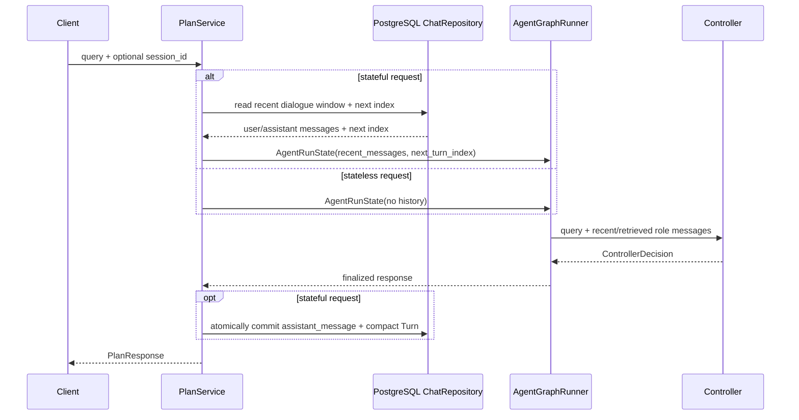

# Controller 层

Controller 是 `/api/v1/plan` 唯一的 LLM 控制入口。它不要求每轮都生成
`ExecutionPlan`，而是返回一个带 discriminator 的 `ControllerDecision`。
所有 LLM-facing decision/basis model 都使用 `extra="forbid"`，混合结构和
未知字段会进入结构化 retry，而不会被静默丢弃。

## 决策契约

```text
direct_answer
clarification
context_missing
capability_boundary
tool_plan(plan: ExecutionPlan)
```

`intent` 只记录用户目标语义，不参与 Graph 路由。`tool_plan` 不重复保存
intent，直接读取 `plan.intent`。

## 候选处理顺序

```text
LLM JSON
  -> Pydantic ControllerDecision parse
  -> normalize basis / missing_fields
  -> tool_plan: apply_sample_policy(plan) exactly once
  -> resolve effective required evidence
  -> shared decision validation
  -> final ExecutionPlan catalog validation
  -> accept or retry with validation feedback
```

重试耗尽时只返回 `planning_error` 或 `decision_validation_error`。Graph 中的
`decision_validate_node` 复用相同确定性校验，但不调用 LLM，也不修改计划。

## 会话回忆

direct recall 只引用真实对话消息：

- `ConversationBasis(turn_index, role)` 的 role 必须与引用模式一致。
- `quote_user_query` 只能引用 `user` 消息。
- `recall_assistant_summary` 只能引用 `assistant` 消息。
- basis 必须能在本次注入的 recent/retrieved messages 中定位；历史事实仍不能
  替代当前工具证据。

“这些技能”“第二个技能”等指称由模型阅读真实上下文后解释；无法唯一判断时返回
`clarification`，而不是依赖固定实体、集合或关系枚举。

校验成功后，`conversation_answer_node` 用确定性模板读取字段。模型给出的
自由回答不能覆盖 recall 结果。social 允许自由文本，但 basis 必须为空。

### 请求与会话上下文

Controller 不直接访问全局 SessionStore。持久化 Chat Run 在进入 Graph 前取得 Redis
recent dialogue window；cache miss/stale 时由 ConversationMemoryService 从
PostgreSQL 重建。消息通过 `state.recent_messages` 注入，旧消息查找结果只存在于本次
Run 的 `state.retrieved_messages`，并由 `conversation.history_lookup` 最多取得一次。



完整请求边界和 Runtime 关系见 [`整体架构.md`](./整体架构.md)。

## clarification

clarification 的 `missing_fields` 使用受约束的开放 snake_case 字段名，问题文本可由
Controller 生成；字段名不是路由键。模型应结合最近 assistant 的澄清和当前输入判断
是否已补齐缺失信息，不应重复已经回答的澄清。
Turn 保存 `query + response_summary + missing_fields`，供下一轮理解补充内容。
后续工具计划仍需重新调用当前轮 resolver，不得复用历史对象 ID 或历史事实。

## 隐私边界

服务端不序列化 `state.recent_messages`、`state.retrieved_messages`、完整历史渲染块、Controller prompt、retry
feedback、raw Controller output 或未脱敏 validation error。每个 session
对应一个用户安全主体；`session_id` 在无独立认证层时视为 bearer capability。

## Prompt Registry（V3.2-2）

Controller 在构造时封存 ToolRegistry，并缓存由静态规则、catalog、contract 和 sample
policy 组成的 Prompt bundle。每个 Run 在调用前记录 renderer 版本和完整 system prompt
的 SHA-256；它表示 configured/prepared Prompt，不表示网络发送成功。历史与用户消息
renderer 只通过版本覆盖动态内容。recovery rules 仍未接线，不进入当前 Prompt 或 manifest。
