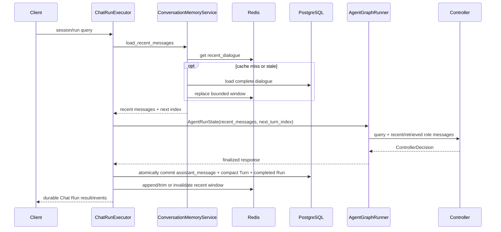

# Controller 层

Controller 是无状态 `/api/v1/plan` 与正式 Chat Run 共用的唯一 LLM 控制入口。
它不要求每轮都生成 `ExecutionPlan`，而是返回一个带 discriminator 的
`ControllerDecision`。
所有 LLM-facing decision model 都使用 `extra="forbid"`，混合结构和未知
字段会进入结构化 retry，而不会被静默丢弃。

## 决策契约

```text
direct_answer
clarification
context_missing
capability_boundary
tool_plan(plan: ExecutionPlan)
```

`intent` 只记录用户目标语义，不参与 Graph 路由。`tool_plan` 不重复保存
intent，直接读取 `plan.intent`。

## 候选处理顺序

```text
LLM JSON
  -> Pydantic ControllerDecision parse
  -> normalize missing_fields
  -> tool_plan: apply_sample_policy(plan) exactly once
  -> resolve effective required evidence
  -> shared decision validation
  -> final ExecutionPlan catalog validation
  -> accept or retry with validation feedback
```

重试耗尽时只返回 `planning_error` 或 `decision_validation_error`。Graph 中的
`decision_validate_node` 复用相同确定性校验，但不调用 LLM，也不修改计划。

## 会话回忆

`direct_answer` 是统一的无工具回答合同。模型可以结合当前请求和真实的
`user/assistant` 对话上下文，理解短追问、继承属性和历史事实，并直接生成
非空 `answer`。不再区分 quote、assistant summary 或 history-grounded mode，
也不要求模型输出 turn-index basis；模型负责语义理解，代码只负责决策结构
和 Graph 边界。

历史事实既不自动失效，也不自动可信。模型应根据主题、属性、范围、来源、版本
和时效判断：稳定且版本与范围一致的历史内容可以由 `direct_answer` 复用；当前、
最新、易变、版本已变、来源不明或存在冲突时，应生成 `tool_plan` 重新验证。只有
歧义阻止有用且准确的回答时才返回 `clarification`；可由短答案覆盖的多个解释应
合并回答。所有这些判断基于真实对话上下文，不依赖固定实体、集合或关系枚举。

历史回答只能复用其中明确出现、且主题/范围/时间窗口/来源一致的数值。只有当历史
明确包含当前请求的每一个统计指标及其数值时，才允许 `direct_answer`。缺少任一指标
时必须在同一次决策中选择 `tool_plan`；不得只复述已知值、声称另一值不可用，或说
需要进一步查询后把查询留给用户。不得由模型推算或补造缺失数字。

校验成功后，`conversation_answer_node` 直接使用 Controller 生成的 answer，
不再读取消息字段或套用确定性回忆模板。direct answer 不创建 EvidenceGraph。

### 请求与会话上下文

Controller 不直接访问全局 SessionStore。持久化 Chat Run 在进入 Graph 前由
`ConversationMemoryService` 取得 Redis recent dialogue window；cache miss/stale 时从
PostgreSQL 重建。消息通过 `state.recent_messages` 注入，旧消息查找结果只存在于本次
Run 的 `state.retrieved_messages`，并由 `conversation.history_lookup` 在配置预算内取得
（默认最多一次）。



完整请求边界和 Runtime 关系见 [`整体架构.md`](./整体架构.md)。

## clarification

clarification 的 `missing_fields` 使用受约束的开放 snake_case 字段名，问题文本可由
Controller 生成；字段名不是路由键。模型应结合最近 assistant 的澄清和当前输入判断
是否已补齐缺失信息，不应重复已经回答的澄清。默认先回答；只有无法给出准确、有界且有用
的答案时才澄清。
下一轮理解补充内容依赖真实 `user/assistant` 消息，而不是 compact Turn 的
`response_summary`。compact Turn 仍保存限长的 query/summary/missing fields 等审计字段，
但不是默认 Prompt 历史。后续工具计划仍需根据当前问题重新规划；稳定、同版本且范围一致的历史事实可以由模型复用，
但当前性、易变性、版本或来源不确定时必须重新调用工具。历史依据不会自动写入
EvidenceGraph。

## 隐私边界

服务端不序列化 `state.recent_messages`、`state.retrieved_messages`、完整历史渲染块、Controller prompt、retry
feedback、raw Controller output 或未脱敏 validation error。每个 session
对应一个用户安全主体；`session_id` 在无独立认证层时视为 bearer capability。

## Prompt Registry（V3.2-2）

Controller 在构造时封存 ToolRegistry，并缓存由静态规则、catalog、contract 和 sample
policy 组成的 Prompt bundle。每个 Run 在调用前记录 renderer 版本和完整 system prompt
的 SHA-256；它表示 configured/prepared Prompt，不表示网络发送成功。历史与用户消息
renderer 只通过版本覆盖动态内容。recovery rules 使用独立 renderer/version，不改变
system Prompt hash。

源码职责上，`agentic/prompts/controller_rules.py` 只保存 Controller 静态行为规则；
`agentic/prompts/controller.py` 是唯一的 Controller bundle/system/message renderer，
并继续组合 ToolRegistry、Contract Registry 与 sample policy 的动态内容。工具的 scope
支持性、参数与排序语义由动态渲染的 `ToolDefinition.description` 提示；Controller 只保留
跨工具 context 放置、枚举解释及查询工具目录/样本策略的通用规则，不重复列举具体工具特例。
当前 DotaMind v1 玩家工具不支持地区或游戏模式过滤；仅当用户明确要求该过滤时才返回
能力边界。当前该边界仅影响 prompt 指引，不新增 Validator 合同或运行时拒绝规则。
