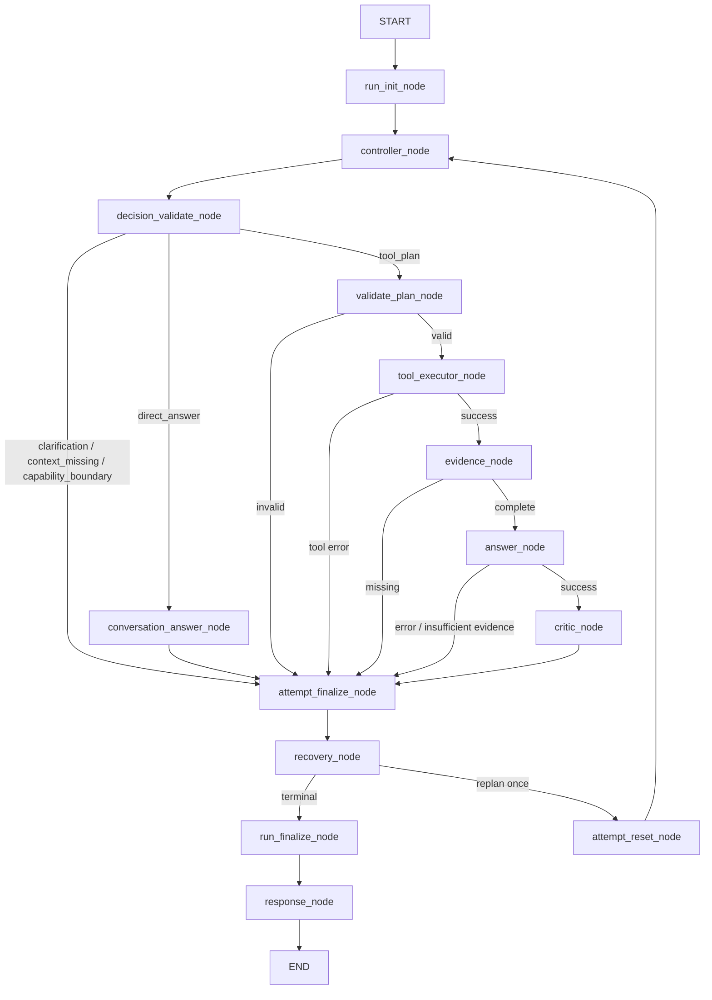

# DotaMind V3 Node / Tool / Edge Inventory

This document records the current bounded Controller architecture. It must
stay aligned with `/api/v1/plan` and `/debug/plan`.

For the end-to-end request, Session, Evidence and Runtime views, start with
[`整体架构.md`](./整体架构.md).

## Runtime Shape



No node routes on `intent`. Only `decision.kind`, validated `tool_calls`, the
output contract, effective evidence and runtime status influence execution.

## V3.2 Runtime Nodes

V3.2-3 wraps the path in one request-level run and at most two controlled Attempts:

```text
START
  -> run_init_node
  -> current Controller/decision/tool path
  -> attempt_finalize_node
  -> recovery_node
      -> terminal -> run_finalize_node -> response_node -> END
      -> replan   -> attempt_reset_node -> controller_node
```

| Node | Responsibility | Phase | Current status |
|---|---|---|---|
| `run_init_node` | Create `RunContext`, audit deadline and global `RunBudget`. | V3.2-1 | Implemented |
| `attempt_finalize_node` | Append an allowlisted `AttemptRecord` without overwriting earlier attempts. | V3.2-3 | Implemented |
| `recovery_node` | Recover only plain global missing-evidence gaps and permit at most one legal replan. | V3.2-3 | Implemented |
| `attempt_reset_node` | Call the centralized flat-state `reset_attempt_working_state()` function. | V3.2-3 | Implemented |
| `run_finalize_node` | Resolve the final public outcome and seal run totals without creating an Attempt. | V3.2-3 | Implemented |

The graph continues to route on decision discriminators, runtime
status and recovery results only. `intent` remains non-executable metadata.

Attempt working fields remain permanently flat on `AgentRunState`. V3.2 does
not introduce `InternalAttemptState`, `current_attempt`, proxy properties or
dual writes. `AttemptRecord` is always an allowlisted audit summary, while all
future reset nodes delegate to the centralized pure reset function.

## Node Inventory

| Node | Responsibility | Tool/Evidence behavior |
|---|---|---|
| `run_init_node` | Fail fast on an existing run, then create UUID4/UTC/monotonic run and attempt state. | Initializes observing-only budget; no business call. |
| `controller_node` | Ask the LLM for one discriminated `ControllerDecision`; apply sample policy to a tool plan before first deterministic plan validation. | No tool execution. |
| `decision_validate_node` | Repeat shared deterministic decision/basis/plan validation without mutating the decision. | Recomputes and refreshes authoritative evidence obligations in state. |
| `conversation_answer_node` | Read only validated `Turn` basis and render recall templates or an approved social answer. | Never creates EvidenceGraph. |
| `validate_plan_node` | Validate final args, references, contract and effective evidence producibility. | Never applies policy or modifies evidence. |
| `tool_executor_node` | Resolve references, reuse Run-local fingerprints and execute registered tools. | Same-id results are reused; changed-id duplicates and per-handler budget/deadline failures are blocked. |
| `evidence_node` | Run tool-owned extractors and compute missing effective evidence and data quality. | Missing effective evidence routes to finalize before Answer. |
| `answer_node` | Produce structured or natural-language answers from EvidenceGraph. | Tool-plan branch only. |
| `critic_node` | Review missing/quality/mock/confidence constraints. | Tool-plan branch only. |
| `attempt_finalize_node` | Call `resolve_terminal_outcome` and append one sanitized immutable AttemptRecord. | Runs once per Attempt. |
| `recovery_node` | Classify a missing-evidence terminal without an LLM call. | Either terminates or records one Replan and feedback. |
| `attempt_reset_node` | Start Attempt 1 through the centralized reset function. | Rechecks deadline before the only back edge. |
| `run_finalize_node` | Resolve final public state and seal Run duration. | Never creates or mutates Attempt records. |
| `response_node` | Require finalized state, apply safe-failure allowlist and serialize public schemas. | Does not recompute terminal priority or serialize recent/retrieved messages. |

## Decision Inventory

| `decision.kind` | Meaning | Terminal mapping |
|---|---|---|
| `direct_answer` | Conversation recall or social response. | `ok/direct_answer` |
| `clarification` | Fixed-enum user input is missing. | `clarification_required/clarification` |
| `context_missing` | Requested conversation context is unavailable. | `insufficient_context/conversation_context_missing` |
| `capability_boundary` | Registered tools cannot satisfy the request. | `insufficient_tools/capability_boundary` |
| `tool_plan` | At least one registered tool call is required. | Full evidence pipeline or explicit error/insufficient evidence. |

`DirectAnswerDecision` quote modes use `ConversationBasis(turn_index, role)`
pointing to an injected real `ConversationMessage`. `quote_user_query` requires
the `user` role and `recall_assistant_summary` requires `assistant`. Older
messages may be added to the request-local context by the internal
`conversation.history_lookup` tool, but historical messages are never current
tool evidence and are never used as routing keys.

## Tool Contract Inventory

Every `ToolDefinition` declares input schema, accepted references, output paths,
source, evidence extractor, producible evidence kinds and primary mandatory
evidence. Startup validation rejects inconsistent registry metadata.

Contract and model-requested evidence remain global kind obligations. Registry
mandatory evidence is an obligation for each successful `tool_call_id`. The
EvidenceGraph groups extracted evidence by call, so two calls of the same tool
cannot borrow one another's primary evidence.

| Tool | Mandatory evidence |
|---|---|
| `resolve_hero` | `hero_identity` |
| `stratz.pair_lane_outcome` | `pair_lane_winrate` |
| `stratz.hero_matchup_ranking` | `matchup_ranking_row` |
| `stratz.hero_synergy_ranking` | `hero_synergy_ranking_row` |
| `stratz.lane_meta_global` | `lane_meta_row` |
| `stratz.hero_position_stats` | `position_stat` |
| `stratz.hero_daily_trends` | `hero_daily_trend` |
| `stratz.filter_heroes_by_position` | `role_filtered_candidate_row` |
| `stratz.player_profile` | `player_identity` |
| `stratz.player_recent_matches` | `player_recent_summary` |
| `stratz.player_hero_performance` | `player_hero_performance` |
| `opendota.resolve_team` | `team_identity` |
| `opendota.team_recent_matches` | `recent_matches` |
| `opendota.team_players` | `current_players` |
| `opendota.team_heroes` | `team_hero_usage` |
| `opendota.hero_stats_by_role` | `hero_stats` |
| `patch.get_records` | `patch_records` |
| `patch.hero_changes` | `hero_patch_changes` |
| `patch.item_changes` | `item_patch_changes` |

`sample_size` remains a normally extracted quality signal, not a universal
mandatory kind in this release.

## Contract Inventory

| Contract | Route | Contract evidence |
|---|---|---|
| `natural_language_answer` | natural language | none by default |
| `patch_impact_report` | structured | `patch_records` |
| `role_meta_report` | structured | `hero_stats` |
| `team_recent_report` | structured | `team_identity`, `recent_matches` |

Effective evidence is the sorted union of contract evidence, selected-tool
mandatory evidence and model-requested evidence. `required_evidence_sources`
uses stable `contract:<name>`, `tool:<name>`, and `planner` labels.

## Error Edges

Top-level mapping is deterministic:

```text
planning_error
  > decision_validation_error
  > tool_error
  > answer_error
  > insufficient_evidence from missing evidence
  > insufficient_evidence from critic quality failure
  > success
```

The ordering means `tool_error` wins when the same failure also causes missing
evidence, and `answer_error` wins over a critic-quality failure. Reference
resolution failures create failed ToolResults; other unclassified runtime
errors map to `execution_error`.

## V3.2-0 Characterization Baseline

The current behavior is frozen by the following existing tests plus the exact
tool-catalog assertion introduced for V3.2-0. Later phases may change internal
state and add target nodes, but these public and semantic invariants must remain
green unless the authoritative design is changed first.

| Frozen invariant | Characterization coverage |
|---|---|
| All five `ControllerDecision` branches and non-tool isolation | `test_controller_decisions.py::test_quote_user_query_uses_validated_turn_and_no_tool_pipeline`, `test_controller_decisions.py::test_social_answer_and_non_tool_decisions_skip_evidence_and_critic`, `test_agentic_graph.py::test_graph_stops_when_tools_are_insufficient`, `test_agentic_graph.py::test_graph_success_reaches_answer_review_and_response` |
| Current graph stops on invalid plans and tool errors, and reaches Answer/Critic only on the valid tool path | `test_agentic_graph.py::test_graph_validation_error_stops_before_tools`, `test_agentic_graph.py::test_graph_tool_error_stops_before_evidence`, `test_agentic_graph.py::test_graph_success_reaches_answer_review_and_response` |
| Terminal error precedence and complete runtime mapping | `test_agentic_nodes.py::test_response_node_prioritizes_tool_error_over_missing_evidence`, `test_agentic_nodes.py::test_response_node_prioritizes_answer_error_over_critic_failure`, `test_agentic_nodes.py::test_response_node_maps_unclassified_runtime_error_to_execution_error`, `test_agentic_runtime.py::test_terminal_outcome_table` (the characterization names remain, but the first three now call `resolve_terminal_outcome`) |
| Session history and Controller internals do not cross the public response boundary | `test_session_privacy.py::test_prior_turn_sentinel_absent_from_next_turn_response`, `test_session_privacy.py::test_history_field_excluded_from_response`, `test_session_privacy.py::test_stateful_safe_failure_persists_only_stable_redacted_turn` |
| Tool catalog is frozen exactly, registry metadata fails fast, and mandatory evidence remains per call | `test_agentic_registry.py::test_default_registry_matches_v32_frozen_tool_catalog`, `test_agentic_registry.py::test_default_registry_declares_primary_mandatory_evidence`, `test_agentic_contracts.py::test_registry_contracts_fail_fast_on_invalid_evidence_declarations`, `test_agentic_evidence.py::test_mandatory_evidence_is_enforced_per_successful_tool_call` |
| Deleted legacy routes stay deleted | `test_plan_route.py::test_removed_legacy_routes_return_404` |

V3.2-0 freezes the catalog contents, not their live upstream values. STRATZ
responses remain volatile and no characterization test may pin exact current
win rates or match counts.

## Explicitly Out of Scope

- raw user/assistant message persistence;
- LangGraph checkpointer state;
- a second LLM judge for free Controller text;
- freshness or universal sample-size policy;
- fixed intent pipelines or a legacy/fallback graph;
- compatibility endpoints or a separate frontend.
