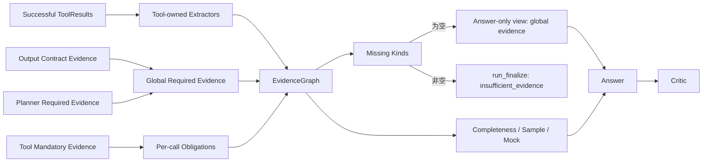

# Evidence 层工作链路详解

> 本文描述 DotaMind v2.5 架构中的 Evidence 层。Evidence 层把工具执行结果转换为统一证据图，记录缺失证据和数据质量；它不生成结论，也不修复工具错误。

## 1. 层定位

Evidence 层位于 Tool 层之后、Answer 层之前：

```text
tool_executor_node
  -> ToolResult[]
  -> evidence_node
  -> build_evidence_graph()
  -> EvidenceGraph
  -> answer_node
```

如果 validate/tool 阶段已经出错，当前 Graph 会直接进入 `run_finalize_node`，不会
构建 EvidenceGraph。只有工具执行成功的计划进入 Evidence 层；若 actual evidence
仍有缺失，V3.2-1 会在 Answer 前收口为 `insufficient_evidence`。

### 跨层证据义务流



## 2. 输入与输出

输入：

- `ExecutionPlan`: 包含 `intent` 和 `required_evidence`。
- `ToolResult[]`: 工具执行结果。
- `ToolRegistry`: 用于找到每个工具的 `evidence_extractor`。

输出：

```python
EvidenceGraph(
    intent=plan.intent,
    tool_results=[...],
    evidence=[...],
    missing=[...],
    data_quality=EvidenceDataQuality(...)
)
```

EvidenceGraph 是 runtime/Critic 的完整审计输入。证据义务有两个不可互换的
视图：

```text
global_required_evidence
= Controller 的 plan.required_evidence + output contract 的固定义务
= Answer-visible obligation

effective_required_evidence
= global_required_evidence + 每个已调用工具的 mandatory_evidence
= runtime / Critic validation obligation
```

Answer 节点会基于 `global_required_evidence` 创建一个浅的 Answer-only view。
工具的 `mandatory_evidence` 仍保留在原始 Graph 中用于 per-call 完整性校验，
不会仅因其 mandatory 来源自动成为 Answer 的展示证据。

## 3. EvidenceItem 结构

每条证据是一个 `EvidenceItem`：

```json
{
  "id": "matchups:matchup_ranking_row:advantage:66:0",
  "kind": "matchup_ranking_row",
  "subject": "Chen vs Lina",
  "value": {
    "hero_id": 66,
    "target_hero_id": 25,
    "win_rate": 0.57,
    "match_count": 247,
    "filters": {...}
  },
  "source": {"name": "STRATZ", "kind": "public_graphql_api"},
  "tool_call_id": "matchups",
  "tool": "stratz.hero_matchup_ranking"
}
```

字段含义：

- `kind`: 证据类型，用于 required evidence coverage。
- `subject`: 人类可读主体。
- `value`: 结构化数值和上下文。
- `source`: 数据来源。
- `tool_call_id`: 来源 tool call。
- `tool`: 来源工具名。

## 4. EvidenceGraph 构建链路

`build_evidence_graph()` 的流程：

```text
for result in tool_results:
  if result.status != "ok":
    missing += "<tool_call_id>: tool_failed"
    continue

  definition = registry.get(result.tool)
  if definition.evidence_extractor is None:
    continue

  evidence += definition.evidence_extractor(result)

evidence_kinds = {item.kind for item in evidence}
for required in plan.required_evidence:
  if required not in evidence_kinds:
    missing += required

data_quality = compute_quality(evidence, tool_results)
```

Extractor 异常不会打断整个 graph 构建，而是记录：

```text
<tool_call_id>: evidence_extractor_failed: <ErrorType>: <message>
```

## 5. Required Evidence 覆盖

Validator 阶段确认 selected tools 理论上能产出 required evidence。Evidence 层确认实际执行后是否真的产出了。

例如 plan 要求：

```json
"required_evidence": ["hero_identity", "matchup_ranking_row", "sample_size"]
```

如果工具执行成功但没有任何 `matchup_ranking_row`，EvidenceGraph 会把它加入
`missing`。当前 Graph 随后直接进入 `run_finalize_node`，不调用 Answer；Critic 中的
missing-evidence 检查保留为纵深防御，但不是正常可达路径。

这区分了两类问题：

```text
Validator:
  这个计划理论上能否产出证据？

Evidence:
  本次执行实际上产出了哪些证据？
```

## 6. Data Quality 计算

当前 `EvidenceDataQuality` 包含：

- `mock_used`: 是否有工具结果来自 mock source。
- `min_sample_size`: 所有 sample_size evidence 中的最小样本数。
- `completeness`: required evidence 覆盖率。

计算规则：

```text
completeness = covered_required_evidence_count / required_evidence_count
min_sample_size = min(item.value.sample_size for kind == "sample_size")
mock_used = any(result.source.status == "mocked")
```

这些指标不会直接生成用户回答，但会影响 Answer 的 data notes 和 Critic 的判断。

## 7. STRATZ 每周 bucket 证据

STRATZ 时间窗口改为 `weeks_back` 后，Tool 层会返回最近 N 个已完成周的 per-week bucket。Evidence extractor 应保留周来源字段，例如：

```json
{
  "week_index": 1,
  "week_epoch": 1782345600,
  "window_label": "latest_completed_week",
  "filters": {
    "weeks_back": 2,
    "week_epochs": [1782345600, 1781740800],
    "skipped_current_week": true
  }
}
```

Evidence 层不跨周聚合，也不重排多周统计。它只把每周 bucket 中的 row 转成带 provenance 的 evidence，让 Answer 层描述趋势。

对于无样本周，推荐保留 empty bucket 或 `missing_week_epochs` 信息，使 Answer 能明确说明“该完整周无样本”，而不是静默消失。

对 `stratz.pair_lane_outcome`，Evidence kind 使用 `pair_lane_outcome`。单条
evidence 同时保留五类对线计数派生的赢/平/输率和独立的整局胜率；位置范围
只读取 `filters.position_ids`，不能使用 STRATZ row 的 `position` 字段推断。

## 8. 与 Answer 层的关系

Answer 节点从完整 EvidenceGraph 创建 Answer-only view：

```text
goal
global_required_evidence
matching EvidenceItems
missing
data_quality
```

原始 EvidenceGraph 仍保留 effective evidence、tool results 和 per-call mandatory
obligations，供 runtime、Critic、审计和确定性下游使用；Answer view 只投影
global planner/contract evidence。自然语言回答必须只使用 Answer view 内的信息，
不得发明统计值。Evidence 层越清楚地保留 filters、source、sample_size、week tags，
Answer 层越容易给出诚实回答。

## 9. 与 Critic 层的关系

在 evidence 完整并进入 Answer 后，Critic 读取 EvidenceGraph：

- `graph.missing` -> 纵深防御检查；正常 Graph 已在 Answer 前拦截。
- `graph.data_quality.mock_used` -> mock source 失败。
- `graph.data_quality.min_sample_size` -> answer confidence 的输入之一。
- `graph.tool_results` -> tool failure 检查。

因此 EvidenceGraph 是“工具执行结果是否足够支撑回答”的核心审计对象。

## 10. 失败路径

```text
ToolResult status=error
  -> missing += "<call_id>: tool_failed"

registry 找不到工具
  -> missing += "<call_id>: unknown_tool"

evidence_extractor 抛错
  -> missing += "<call_id>: evidence_extractor_failed: ..."

required evidence 未出现
  -> missing += "<evidence_kind>"
```

Evidence 层不会重试工具，也不会补调用工具。V3.2-1 直接终止；自动补证由后续
V3.2-3 的 `recovery_node` 和 `attempt_reset_node` 实现。

## 11. 层边界

Evidence 层负责：

- 从 ToolResult 提取 EvidenceItem。
- 记录实际缺失证据。
- 计算数据质量摘要。
- 保留 source/filter/sample/week provenance。

Evidence 层不负责：

- 选择工具。
- 执行工具。
- 修复上游错误。
- 判断自然语言措辞。
- 跨周聚合或排名。
- 将 evidence 改写为结论。

## 12. 新增 evidence extractor 原则

新增工具时，extractor 应：

- 只读取该工具 `ToolResult.data`。
- 输出稳定的 `kind`，与 `evidence_kinds` 一致。
- 为每条 evidence 设置可追踪 `id`。
- 保留 sample size、filters、source-specific provenance。
- 对缺失 row 返回空列表，而不是伪造 evidence。
- 不进行自然语言总结。

比赛详情的选手进度采用两段式边界：`opendota.match_details` extractor 只发出
核心比赛 evidence；用户明确询问出装、加点或天赋时，Controller 追加
`dota.extract_match_player_progress`，其 extractor 只读取前序 `data.matches` 的
窄投影，并为每局输出一条完整 `player_match_progress` evidence。其购买部分是
确定性的 `purchase_display`：负时间事件聚合为出门装，非负时间事件仅按维护的
消耗品/守卫内部名集合过滤，成品事件携带完成时间；原始标准化购买事件仍保留在
上游 ToolResult 中供审计和确定性 transform 使用，但不因核心详情请求自动复制为
progress evidence。技能加点中的普通已解析技能可携带本地
`ability_image_path`，天赋、属性加成和未解析技能保持空值；PandaScore Fixture
中的 `team_image_path` 同样只来自本地 manifest 命中，不改变 Evidence 的事实选择或
可见性边界。

