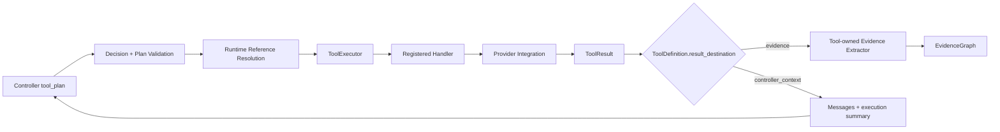

# Tool 层工作链路详解

> 本文描述 DotaMind v2.5 架构中的 Tool 层。Tool 层是确定性执行边界：Planner 只声明要调用什么工具，Tool 层负责解析引用、校验参数、调用 handler、捕获错误，并把结果封装成 `ToolResult`。

## 1. 层定位

Tool 层位于 validator 之后、evidence 之前：

```text
validate_plan_node
  -> tool_executor_node
  -> ToolExecutor
  -> ToolDefinition.handler
  -> ToolResult[]
  -> result_destination routing
      -> evidence_node
      -> controller_context -> controller_node
```

它的职责是执行经过校验的 `tool_calls`，但不负责最终解释结果。

### 跨层执行链路



Planner、Validator、Executor 和 Evidence 层消费同一份 `ToolDefinition`，但只有
ToolExecutor 能进入 handler；LLM 不接触 provider URL、认证信息或请求正文。

## 2. ToolDefinition 是能力契约

每个工具由 `ToolDefinition` 注册：

```python
ToolDefinition(
    name="stratz.hero_matchup_ranking",
    description="...",
    input_model=HeroMatchupRankingInput,
    handler=_hero_matchup_ranking_handler(settings),
    result_destination="evidence",
    source=ToolSource(...),
    evidence_extractor=hero_matchup_ranking_evidence,
    evidence_kinds=("matchup_ranking_row", "sample_size"),
    arg_contracts={...},
    output_paths={...},
    metadata={...},
)
```

字段含义：

- `name`: Planner 可见的工具名。
- `description`: Planner 用来理解能力边界的文字。
- `input_model`: 参数 schema，由 Pydantic 校验。
- `handler`: 实际执行函数。
- `result_destination`: 结果进入 `evidence` 或 `controller_context`；默认是
  `evidence`，Graph 与 Validator 按该字段处理，不按工具名分支。
- `source`: 数据来源。
- `evidence_extractor`: ToolResult -> EvidenceItem 的转换器。
- `evidence_kinds`: 该工具能产出的证据类型。
- `arg_contracts`: 参数语义和可接受引用来源。
- `output_paths`: 后续工具可引用的稳定输出路径。
- `metadata`: trace 和结果附加元信息。

ToolDefinition 同时服务四层：

```text
Planner prompt renderer
Validator
ToolExecutor
Graph result routing / EvidenceGraph
```

因此它是工具契约的单一事实源。

## 3. Registry 构建链路

当前默认 registry 由 `build_default_tool_registry(settings)` 构建：

```text
ToolRegistry()
  -> register_stratz_tools
  -> register_opendota_tools
  -> register_pandascore_tools
  -> register_opendota_match_tools
  -> register_patch_tools
```

`PlanService` 初始化时创建 registry，并把同一份 registry 传给：

- `AgentController`
- `AgentGraphRunner`
- `ToolExecutor`
- `EvidenceGraph` builder

V3.2-2 中，默认 `PlanService` 装配会把同一 Registry 实例传给这些组件，`AgentController`
在 Prompt 渲染前关闭其注册期。之后 `register()` 直接失败，读取路径保持不变；这只约束默认
装配的注册集合，不会深度冻结 ToolDefinition 内部映射，也不校验任意注入对象的身份。

因此默认路径中 Planner、Validator 与 Executor 都从同一已关闭注册期的 Registry 读取工具目录。

第一阶段比赛工具的引用边界如下：

- `pandascore.resolve_competition` 输出 `data.competition.series_id`。
- `pandascore.list_matches` 和 `pandascore.resolve_match_game` 只能引用该 Series。
- `resolve_match_game` 输出明确命名的 PandaScore Match/Game ID；免费 Fixture 未提供
  Valve ID 时输出 `pending_valve_match_id`，不调用付费详情接口兜底。
- `opendota.match_summary` 可接受用户字面量 Valve ID 或 PandaScore resolver 的明确引用。
- `opendota.match_draft` 只能引用 PandaScore resolver 或 OpenDota summary 的 Valve ID。

PandaScore 赛事 Fixture 事实与 OpenDota Valve/Replay 事实分别进入 EvidenceGraph；
`detailed_stats` 不是 `has_parsed`，空 BP 不产生 `match_draft` 证据。

## 4. ToolExecutor Node 链路

`tool_executor_node` 接收已通过 validator 的 `state.plan`：

```text
for call in plan.tool_calls:
  resolved_args = _resolve_args(call.args, previous_results)
  result, dispatch = executor.execute(
      ToolCall(call.id, call.tool, resolved_args),
      context,
      on_handler_entered=run_budget.record_tool_call,
  )
  state.tool_results.append(result)
  state.tool_dispatch_records.append(dispatch)
  previous_results[call.id] = result
```

执行顺序就是 `tool_calls` 数组顺序。全部调用完成后，Graph 根据所选工具统一声明的
`result_destination` 处理结果：`evidence` 进入 EvidenceGraph；`controller_context` 合并
请求级消息与最小执行摘要后再次调用 Controller。两种 destination 不允许出现在同一计划。

如果某个调用的引用解析失败：

- 该调用被跳过。
- 错误写入 `state.errors`。
- 后续依赖它的调用也会因为 reference target unavailable 失败。

如果任一工具返回 `status="error"`：

- 错误写入 `state.errors`。
- node 最终 `state.status="error"`。
- graph 直接进入 `run_finalize_node`，不再构建 EvidenceGraph 或进入 Answer。

## 5. Runtime Reference 解析

Validator 只验证 `$ref` 合法性；Tool node 才解析真实值。

解析规则：

```text
$<call_id>.<path>
```

例如：

```json
"hero_id": "$resolve_lina.data.hero.hero_id"
```

Runtime 查找流程：

```text
parse_reference()
  -> results_by_id[call_id]
  -> result.status must be ok
  -> lookup_path(result.model_dump(mode="json"), path_parts)
  -> resolved value
```

如果引用目标不存在、目标工具失败、或 path 找不到，就返回解析错误。

## 6. ToolExecutor 执行单个工具

`ToolExecutor.execute(call, context, on_handler_entered=...)` 的内部流程：

```text
registry.get(call.tool)
  -> definition.input_model.model_validate(call.args)
  -> on_handler_entered()             # 这里才消耗工具预算
  -> definition.handler(validated_args, context)
  -> await if awaitable
  -> (ToolResult, ToolDispatchRecord)
```

如果过程中抛异常：

```text
registry/input validation error
  -> ToolResult(status="error")
  -> ToolDispatchRecord(handler_entered=false, stage="pre_dispatch")

handler exception
  -> ToolResult(status="error", error="TypeError: ...")
  -> ToolDispatchRecord(handler_entered=true, stage="handler")
```

ToolExecutor 不抛出业务异常给上层，而是把异常结构化为 `ToolResult`，让 evidence/critic/response 能统一处理。
`ToolDispatchRecord` 是预算和 Attempt 摘要使用的非公开审计旁路，不写入公开
`ToolResult.metadata`。Reference resolution 在 node 层失败时也生成对应 dispatch
记录，但不会消耗 handler 工具预算。

## 7. QueryContext 的作用

`QueryContext` 是 plan-level scope，不属于单个 tool args：

```json
"context": {
  "bracket": ["DIVINE_IMMORTAL"],
  "weeks_back": 2,
  "position_ids": ["POSITION_4"],
  "region_ids": null,
  "game_mode_ids": null
}
```

Tool handler 接收：

```python
handler(validated_args, context)
```

这样同一个 scope 可以应用到 plan 中多个工具，Planner 不需要把 bracket、weeks_back 等重复塞进每个 tool args。

STRATZ 特别规则：

- Planner 只输出 `weeks_back`。
- STRATZ handler 解析最近 N 个已完成 week epoch。
- 每个 epoch 单独调用底层 STRATZ client。
- 返回 per-week bucket，并在 filters/evidence 中标注完整周口径。

`stratz.pair_lane_outcome` 的 Evidence kind 为 `pair_lane_outcome`，同时透传
五类对线计数派生的 lane win/draw/loss rates 与独立的 match win rate。其位置
范围以 `filters.position_ids` 为准；STRATZ row 的 `position` 不作为请求位置回显。

`stratz.filter_ranked_heroes_by_position` 是排名候选的专用位置资格过滤工具，
只接收 `stratz.hero_matchup_ranking` 或 `stratz.hero_synergy_ranking` 暴露的
`data.candidate_rows` 引用。它查询指定位置的 STRATZ 样本，按
`min_position_match_count` 过滤并附加位置场次和胜率；保留原排名字段与顺序，
不生成复合评分。`candidate_rows` 由 `requires_reference` 强制为当前计划的前序引用，
不能由 Planner 直接构造。

## 8. 底层 integration 与 agentic tool 的边界

底层 integration 负责 provider-native API：

```text
app/integrations/stratz/heroes.py
app/integrations/opendota/*
```

Agentic tool 负责把 provider 能力包装成 v2.5 工具：

```text
app/agentic/tools/stratz_tools.py
app/agentic/tools/opendota_tools.py
app/agentic/tools/patch_tools.py
```

LLM 不直接接触底层 client，不知道 URL、GraphQL body 或 token。它只看 ToolDefinition 渲染出的工具目录。

## 9. ToolResult 结构

工具返回统一包装：

```json
{
  "tool_call_id": "matchups",
  "tool": "stratz.hero_matchup_ranking",
  "status": "ok",
  "data": {...},
  "source": {
    "name": "STRATZ",
    "kind": "public_graphql_api",
    "url": "..."
  },
  "latency_ms": 123,
  "error": null,
  "metadata": {...}
}
```

`data` 是工具自己的结构化结果。Evidence 层通过对应 extractor 读取它。

## 10. 失败路径

```text
unknown tool
  -> Validator 应提前拦截
  -> Executor 若遇到仍返回 ToolResult error

args invalid
  -> Validator 应提前拦截
  -> Executor 再次 model_validate，失败返回 ToolResult error

reference target failed
  -> tool node 解析失败
  -> state.errors

upstream API error
  -> handler 抛错
  -> ToolResult(status="error")

missing token / config
  -> handler 抛错
  -> ToolResult(status="error")
```

项目偏好是暴露错误，而不是用 mock 或 fallback 掩盖缺口。

## 11. 层边界

Tool 层负责：

- 解析真实 `$ref` 值。
- 校验并执行工具参数。
- 调用 deterministic handler。
- 捕获 upstream/config/runtime 错误。
- 返回结构化 ToolResult。

Tool 层不负责：

- 自然语言回答。
- 判断 required_evidence 是否满足。
- 生成 EvidenceGraph。
- 根据 `intent` 选择固定 pipeline。
- 把 upstream 错误伪装成成功。

## 12. 新增工具流程

推荐步骤：

1. 定义 `input_model`。
2. 实现 deterministic `handler(args, context)`。
3. 声明 `ToolSource`。
4. 声明 `evidence_extractor` 和 `evidence_kinds`。
5. 如需被后续工具引用，声明 `output_paths`。
6. 如需接收前序工具引用，声明 `arg_contracts.accepts_refs`。
7. 注册到默认 registry。
8. 增加 validator、executor、evidence tests。

