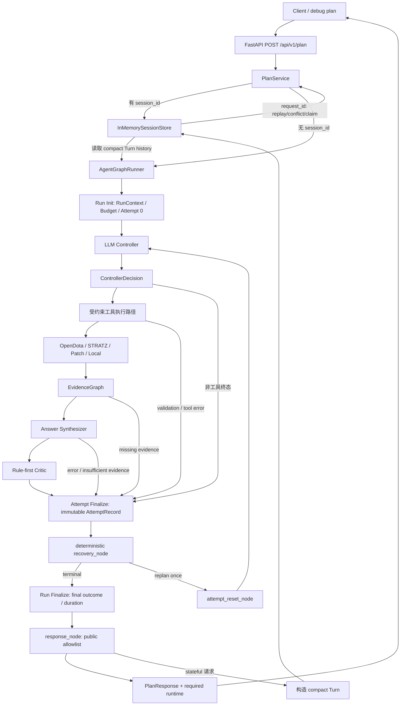
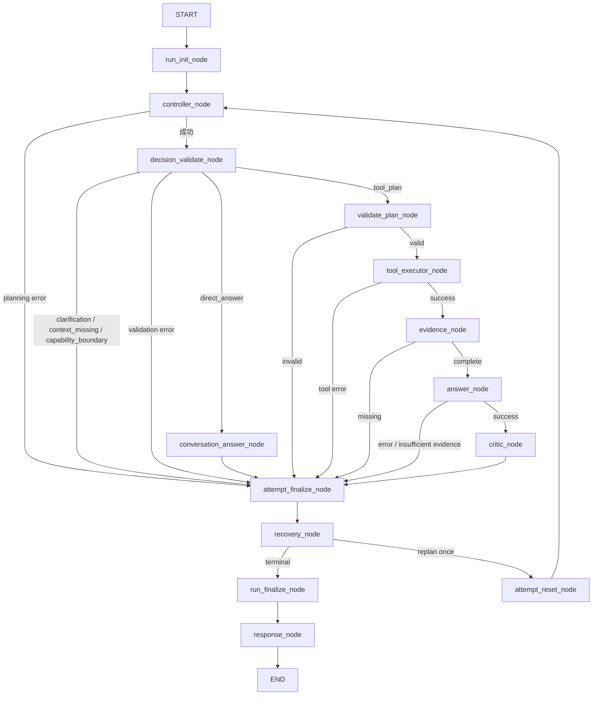
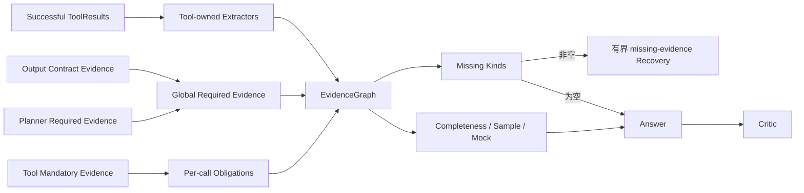
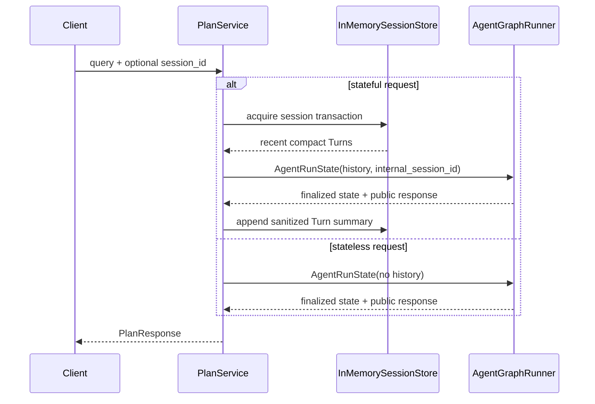

# DotaMind 整体架构

> 本文描述当前工作树已经实现的 V3.2-4 stateful request idempotency 与 V3.2-3
> 有界 missing-evidence Recovery/Replan 架构。版本阶段目标以
> [`../versions/DotaMind_V3.2_design.md`](../versions/DotaMind_V3.2_design.md)
> 为准，节点和工具精确清单以
> [`DotaMind_V3_node_tool_edge_inventory.md`](./DotaMind_V3_node_tool_edge_inventory.md)
> 为准。

## 1. 当前总体架构

DotaMind 只有一条 Agentic 后端路径。旧固定 report pipeline 和兼容 endpoint 已删除，
`POST /api/v1/plan` 与 `/debug/plan` 共同使用同一个 `PlanService`、Tool Registry 和
Graph。



## 2. 当前 Graph

每个受控请求拥有一个 `RunContext`、一个累计 `RunBudget` 和一到两个脱敏
`AttemptRecord`。Graph 只有 `attempt_reset_node -> controller_node` 一条受控回边。



Graph 只按 `decision.kind` 和运行状态路由。`intent` 仅描述用户目标，不选择固定
pipeline；真正的执行路线由经过校验的 `tool_calls` 决定。

## 3. Controller 与受约束 Tool Calling

Controller 每轮只返回五种带 discriminator 的决策之一：

```text
direct_answer
clarification
context_missing
capability_boundary
tool_plan(plan: ExecutionPlan)
```

只有 `tool_plan` 进入外部数据路径：

```mermaid
flowchart LR
    Controller["Controller tool_plan"] --> Validate["Decision + Plan Validation"]
    Validate --> References["Runtime Reference Resolution"]
    References --> Executor["ToolExecutor"]
    Executor --> Handler["Registered Handler"]
    Handler --> Integration["Provider Integration"]
    Integration --> Result["ToolResult"]
    Result --> Extractor["Tool-owned Evidence Extractor"]
    Extractor --> Evidence["EvidenceGraph"]
```



`ToolDefinition` 是 Planner、Validator、Executor 和 Evidence extractor 共享的能力契约。
LLM 不能动态注册工具、拼接 URL、GraphQL 或 SQL。ToolExecutor 通过非公开
`ToolDispatchRecord` 记录 handler 是否真正进入；只有 handler 入口消耗工具预算，
dispatch 信息不会写入公开 `ToolResult`。

## 4. Evidence 义务与质量流



Contract 和 Planner evidence 按全局 kind 检查；Tool Registry 的 mandatory evidence
按每个成功 `tool_call_id` 检查，不能跨调用借用。missing evidence 出现时仍不调用
Answer；只有全部缺口都是普通全局 kind、且存在此前未使用的 producer 时，V3.2-3
才允许一次补证 Replan。Critic Recovery 不在首版范围。

## 5. Run / Attempt / Budget

```text
AgentRunState
├── RunContext
│   ├── run_id
│   ├── internal session_id
│   ├── started_at / deadline_at
│   └── prompt_versions（V3.2-2：configured/prepared renderer manifest）
├── RunBudget
│   ├── controller/tool/answer/replan limits
│   └── controller/tool/answer/replan used
├── 当前 attempt 工作字段（永久平铺）
├── AttemptRecord[1..2]（严格脱敏、封存后不回写）
├── RecoveryFeedback / baseline decision / Run-local fingerprint cache（内部）
├── terminal_stage / run_duration_ms
└── timed trace
```

`AttemptRecord` 不保存完整 `ExecutionPlan`、`ToolResult.data`、回答文本、Critic reasons、
history、Prompt、Controller 原文或原始异常。公开 `runtime` 在此基础上再做严格 DTO
映射。V3.2-3 在业务节点入口和每个未复用 handler 前执行 budget/deadline guard；
attempt/recovery/run/response 收口路径可以越过 deadline。

## 6. Session Memory



Session 只保存 compact `Turn`，不保存原始消息，也不使用 LangGraph checkpointer。
当前后端是单进程 `InMemorySessionStore`；Redis、多 worker lease/fencing 和 request
幂等属于后续阶段。

## 7. 终态与公开响应

`attempt_finalize_node` 使用纯函数 `resolve_terminal_outcome()` 封存每个 Attempt；
`run_finalize_node` 只归约最终公开状态和 Run 总耗时。优先级为：

```text
planning_error
  > decision_validation_error
  > tool_error
  > answer_error
  > execution_budget_error / execution_timeout
  > replan_exhausted
  > missing evidence
  > critic quality failure
  > success
```

`response_node` 不再解释终态，只验证 finalized state，并序列化现有业务字段和必有
`runtime`：

```text
runtime
├── run_id / duration_ms / terminal_stage
├── budget.limits / budget.used
└── attempts[0..1]
    ├── status / failure_stage / recovery_code / duration_ms
    ├── tool_call_statuses（含 reused）
    ├── evidence_summary
    ├── answer_summary（无正文）
    └── critic_summary（无 reasons）
```

Stateful safe failure 仍返回 runtime，但 Attempt 被裁剪为最小摘要；公开 response、
trace 和 runtime 均不得包含 history 或内部原始内容。

## 8. 当前能力与后续目标

| 能力 | 当前 V3.2-4 | 后续阶段 |
|---|---:|---|
| 单一 Agentic Graph | 已实现 | 保持 |
| Run / Budget / 最多两个 Attempt | 已实现 | 保持有界 |
| Evidence 缺口检测与可恢复性判断 | 已实现 | Critic quality code 延后 |
| 单次 missing-evidence Replan | 已实现 | 不扩为通用循环 |
| 成功/失败 ToolResult 指纹复用 | 已实现 | V3.2-6 再补指标 |
| Deadline 强制门禁 | 已实现 | V3.2-6 补取消收口 |
| Prompt Registry/version/hash | 已实现（configured/prepared hash） | V3.2-2 |
| stateful `request_id` 幂等 | 已实现（memory / single process） | V3.2-5 Redis |
| Redis Session Store | 未实现 | V3.2-5 |
| 故障注入与取消收口 | 未实现 | V3.2-6 |

V3.2-3 的 Graph 循环仍为：

```text
attempt_finalize_node
  -> recovery_node
      -> terminal -> run_finalize_node
      -> replan   -> attempt_reset_node -> controller_node
```

该循环仍然最多 Replan 一次，不是开放式 autonomous loop。

V3.2-4 在 Graph 之前把 stateful request 包进同一 Session transaction：同 key 同 hash
重放 allowlisted response、不同 hash 返回 `idempotency_conflict`；首次执行通过原子
`complete_request_with_turn` 同时写入 Turn 和 completed RequestRecord。它不增加 Graph
节点或回边。
