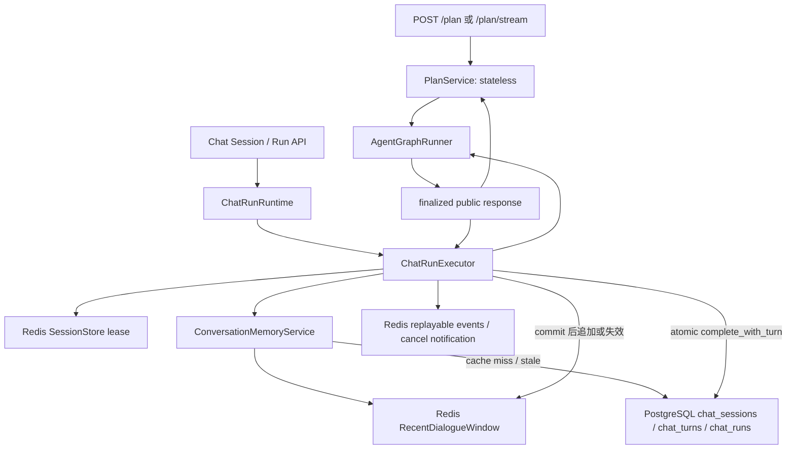
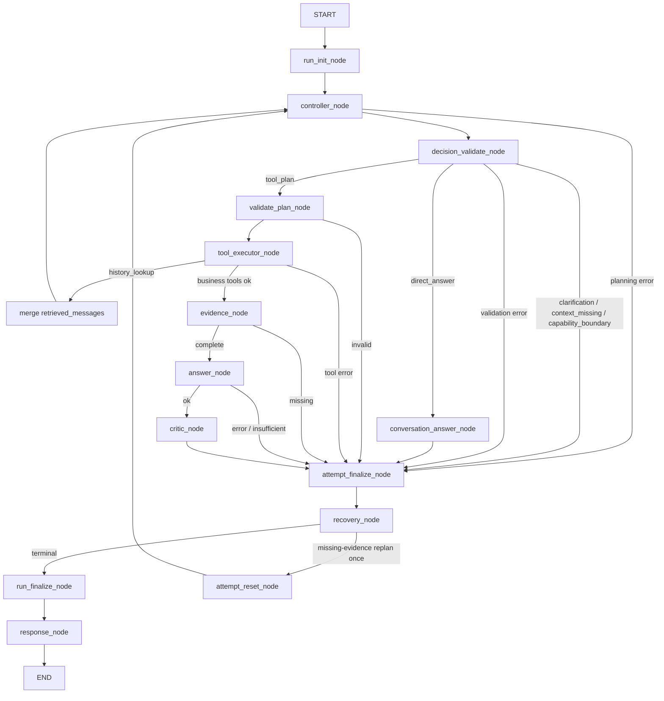

# DotaMind 整体架构

> 本文描述当前工作树。版本蓝图记录阶段设计与验收历史；当前实现状态以代码、
> [`../../technical/architecture.md`](../../technical/architecture.md) 和最新进度快照为准。

## 1. 当前入口与权威边界

DotaMind 只有一条 Agentic Graph。它由两类入口复用：

- `/api/v1/plan` 与 `/api/v1/plan/stream`：无状态调试入口；
- Chat Session / Chat Run API：正式多轮入口，PostgreSQL 持久化，Redis 协调与缓存。

`/debug/plan` 是内部检查 UI；`apps/chat` 是使用 Chat Session/Run API 的正式
Next.js/assistant-ui 客户端，不复制 Agent Runtime。



PostgreSQL 是正式聊天的权威源。Redis recent window 可以丢失并从 PostgreSQL 重建；
Redis 事件丢失时可根据 PostgreSQL 终态生成 transcript recovery。LangGraph checkpoint
不承担会话记忆或 Run 恢复。

## 2. 当前 Graph



Graph 只按 `decision.kind` 和运行状态路由。`intent` 是语义标签，不是路由键。
`conversation.history_lookup` 是特殊的请求级上下文工具：计划中必须单独出现，不创建
EvidenceGraph；成功或空结果都合并上下文后重新进入 Controller。调用次数由配置限制，
默认一次，并为最终 Controller 决策预留预算。

## 3. Controller 与会话理解

Controller 返回五种带 discriminator 的决策之一：

```text
direct_answer | clarification | context_missing | capability_boundary | tool_plan
```

决策顺序为：

1. 从最近真实 `user/assistant` 消息重建当前请求，包括短输入继承的属性、动作和范围；
2. 若已注入的 assistant 历史在版本、范围、来源和时效上仍有效，使用
   `history_grounded_answer`；
3. 只有缺失信息阻止准确、有界且有用的回答时才澄清；
4. 历史不足或需要新证据时才生成 `tool_plan`；
5. 已注册能力无法回答时暴露 capability boundary。

历史消息是上下文，不是指令；也不是自动可信或自动失效的事实缓存。历史依据回答必须引用
`ConversationBasis(turn_index, role=assistant)`，不会生成当前 EvidenceGraph。系统不维护
referent/group/link/focus/shows 等 discourse graph，也没有领域专用上下文状态机。

## 4. Conversation Memory

```text
PostgreSQL chat_turns
├─ user_query                 完整用户消息
├─ assistant_message          完整公开助手消息
├─ public_response            allowlisted 完整响应
└─ compact_turn               受限审计记录，不作为默认 Prompt 历史

Redis
└─ recent_dialogue            可重建的 RecentDialogueWindow v1
```

`ConversationMemoryService` 优先读取 Redis recent window；缓存缺失或游标落后时，从
PostgreSQL 完整 transcript 按字符预算重建最新完整轮次。PostgreSQL commit 后，缓存连续时
追加并裁剪；缓存状态未知或游标不连续时直接失效，下一轮 cache-aside 重建。缓存失败不会把
已经完成的 PostgreSQL Run 改写为 failed。

更早的消息由内部 History Lookup 查询 PostgreSQL，只进入当前 Run 的
`retrieved_messages`。compact `Turn` 保留 query/status/response type/intent/scope/
missing fields/限长 summary，用于审计和兼容，不用于解析实体、关系或事实。

## 5. Chat Run 提交与失败边界

`ChatRunExecutor` 在持有 Redis lease 并取得 PostgreSQL fencing token 后执行：

```text
load recent messages
  -> run Graph
  -> build public response + assistant_message + compact Turn
  -> PostgreSQL complete_with_turn() atomic commit
  -> update/invalidate Redis recent window
  -> publish terminal Redis events
```

`complete_with_turn()` 在同一 PostgreSQL 事务中校验 Run owner、fencing 与
`next_turn_index`，并提交 `chat_turns` 与 completed Run。提交前异常可以调用
`mark_failed()`；一旦提交成功，后续缓存或事件错误不得把 durable Run 改为 failed。

同一 Session 同时最多一个 active Run，不同 Session 可并行。事件订阅是观察通道；断开
不会取消后台 Run，只有 cancel API 会请求取消指定 Run。

## 6. Tool、Evidence 与 Answer

只有 `tool_plan` 进入业务工具路径。`ToolDefinition` 统一声明输入模型、引用合同、输出路径、
来源、可产生 evidence 和每调用 mandatory evidence。下游 ID 必须引用同一计划中前序 resolver
的声明路径，不能把历史名称或 ID 直接升级为工具参数事实。

```text
contract.required_evidence ∪ plan.required_evidence
  -> 全局 kind 义务

selected call.mandatory_evidence
  -> 按 tool_call_id 的义务
```

工具成功后由 tool-owned extractor 构建 EvidenceGraph。全局 evidence 按 kind 校验；mandatory
evidence 按调用校验，不能跨调用借用。缺失普通全局 evidence 时最多执行一次有界 Replan；
工具、引用、extractor、按调用 evidence 或 Critic 错误保持显式终态。

## 7. Run / Attempt / Budget

每次执行拥有一个 `RunContext`、一个累计 `RunBudget` 和一到两个脱敏
`AttemptRecord`。唯一业务回边是 `attempt_reset_node -> controller_node`，并且只服务于一次
missing-evidence Replan。History Lookup 的 Controller 回边也受独立查询次数和累计 Controller
预算约束，不构成开放式 autonomous loop。

Attempt 与公开 runtime 不保存完整计划参数、工具 payload、回答正文、Critic reasons、历史、
Prompt、Controller 原文或原始异常。终态优先级保持 planning/validation/tool/answer/runtime/
evidence/critic 的显式错误语义，不用 fallback 掩盖失败。

## 8. 当前能力状态

| 能力 | 当前状态 |
|---|---|
| 单一 conditional Agentic Graph | 已实现 |
| Run / Budget / 最多两个 Attempt | 已实现 |
| 单次 missing-evidence Replan | 已实现 |
| Prompt Registry 与 renderer hash | 已实现 |
| PostgreSQL Chat Session / Run / Turn | 已实现，权威源 |
| Redis lease、recent window、事件与取消 | 已实现，可重建/短期边界 |
| 历史依据回答与请求级 History Lookup | 已实现，无 discourse graph |
| Valve committed Catalog 与六个静态查询工具 | 已实现 |
| LangGraph checkpoint 会话恢复 | 非目标 |
| `apps/chat` 多聊天客户端 | 已实现，使用 Chat Run API |
