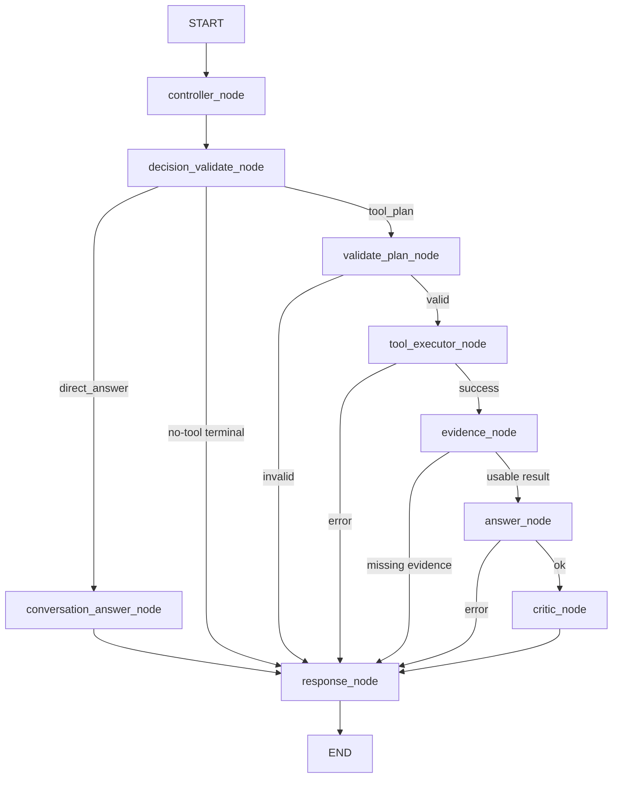

# DotaMind V3.0 统一设计文档

> 本文是 DotaMind V3.0 的当前主设计入口。自 2026-07-18 起，产品展示、
> 代码文案、环境变量、包元数据和文档文件名统一使用 `DotaMind` / `DOTAMIND_*`
> 命名。v2.5 仍表示受约束 Tool Calling 架构版本，不是独立产品品牌。

更新日期：2026-07-08

主要来源：

- [DotaMind_MVP_v2.5.md](./DotaMind_MVP_v2.5.md)：受约束 Tool Calling
  架构底座。
- [DotaMind_V3_node_tool_edge_inventory.md](../architecture/DotaMind_V3_node_tool_edge_inventory.md)：
  LangGraph node / tool / edge 实现盘点。
- [V3.0_功能闭环缺口盘点.md](../roadmaps/V3.0_功能闭环缺口盘点.md)：V3.0 功能闭环
  目标和缺口路线图。
- [architecture.md](../../technical/architecture.md)：当前实现地图。
- [stratz_hero_page_graphql_inventory.md](../../technical/stratz_hero_page_graphql_inventory.md)
  与 STRATZ 相关 technical inventory：STRATZ GraphQL 工具设计依据。

---

## 1. 产品与版本定位

DotaMind 是面向 Dota 2 的 evidence-grounded 智能问答与分析系统。V3.0
的目标不是“更多固定功能入口”，而是让常见用户问题在受约束 agentic
架构中形成基础完整闭环：

```text
用户查询 -> planner 生成工具计划 -> 工具取证 -> EvidenceGraph ->
answer 生成回答 -> critic 审查 -> response 明确返回
```

### 1.1 V3.0 与 v2.5 的关系

v2.5 是架构范式，V3.0 是产品能力阶段。

| 维度 | v2.5 | V3.0 |
|---|---|---|
| 定位 | 架构底座 | 当前产品能力目标 |
| 核心问题 | 如何从固定 pipeline 迁移到受约束工具规划 | 高频 Dota 查询能否真正闭环 |
| 关注对象 | `ExecutionPlan`、`tool_calls`、contract、validator、EvidenceGraph | query 能否接上工具、证据、回答和 critic |
| 成功标准 | 不再新增固定业务 pipeline | 基础用户问题不再频繁 `insufficient_tools` |

因此，V3.0 仍必须遵守 v2.5 的硬边界：

- `intent` 只是用户目标的语义标签，不是路由键。
- 执行路径只由通过校验的 `tool_calls` 决定。
- 响应形态由 `output_contract` 决定。
- 证据义务由 `required_evidence` 和 contract rules 决定。
- 不允许通过 `if intent == "...": run_special_pipeline()` 复活旧式固定链路。

---

## 2. 设计原则

1. **受约束工具规划**
   Planner 只产出结构化 `ExecutionPlan`。工具列表、参数、引用和 evidence
   都必须来自 registry / contract。

2. **确定性执行边界**
   ToolExecutor 和工具 handler 负责取数、校验、引用解析和错误捕获。LLM 不拼
   GraphQL、SQL、HTTP URL 或内部 Python 调用。

3. **Evidence-first**
   工具输出结构化数据；EvidenceGraph 记录来源、样本、缺失项和数据质量。
   Answer 只能基于 evidence 生成结论。

4. **显式暴露能力边界**
   缺工具、参数不合法、上游错误、证据不足、critic failed 都应直接返回，
   不用 fallback、mock 或旧链路伪装成功。

5. **工具化优先于新 pipeline**
   新能力应优先拆成 deterministic tools、evidence extractors、output
   contracts 或 answer/critic rules，而不是新增业务专用 graph branch。

6. **薄组合，不发明分数**
   当前阶段的 ranking/filter 工具应透传真实来源字段和样本依据。除非另有设计，
   不发明 5v5 阵容评分、综合推荐分或不可解释聚合分。

7. **开发期优先删除与收敛**
   项目仍处于 active development。已迁移到 agentic 架构的能力不保留旧兼容
   path；废弃路径应删除或明确标记。

---

## 3. 项目现状

### 3.1 当前 active API

当前后端只有一个主业务入口：

```text
POST /api/v1/plan
```

辅助入口：

```text
GET /debug/plan
GET /health
```

旧 Next.js 前端已经删除。内部查询测试 UI 统一使用 `/debug/plan`，不再维护
独立前端运行时或兼容路径。

### 3.2 当前整体链路

```text
POST /api/v1/plan
  -> PlanService
  -> AgentGraphRunner
  -> LangGraph StateGraph(AgentRunState)
      -> controller_node
      -> decision_validate_node
          -> direct_answer -> conversation_answer_node -> response_node
          -> clarification/context_missing/capability_boundary -> response_node
          -> tool_plan -> validate_plan_node -> tool_executor_node
                       -> evidence_node -> answer_node -> critic_node -> response_node
```

当前实现已经使用 LangGraph `StateGraph` 承载节点编排。Graph 只表达通用
节点和错误短路，不为 counter、synergy、player、team 等能力添加业务分支。

### 3.3 当前 node / edge 形态



`replan_node` 尚未实现。critic -> planner retry 属于 V3.1 / Sample Policy
阶段 2 方向，必须保持有界：例如 `max_replans=1`、总工具调用上限、禁止同工具
同参数无限重复。

---

## 4. 模块实现地图

| 模块 | 当前职责 |
|---|---|
| `apps/api/app/application/plan_service.py` | `/api/v1/plan` use case；创建 registry、planner、graph runner。 |
| `apps/api/app/agentic/graph.py` | LangGraph `StateGraph` 编排和 node dependency injection。 |
| `apps/api/app/agentic/state.py` | `AgentRunState`、trace、status、response holder。 |
| `apps/api/app/agentic/models.py` | `ExecutionPlan`、`ToolCall`、`QueryContext`、`ToolResult`。 |
| `apps/api/app/agentic/planning/controller.py` | LLM Controller、discriminated decisions、validation retry、sample policy backfill。 |
| `apps/api/app/agentic/planning/contracts.py` | output contracts、tool prompt renderer、plan validation。 |
| `apps/api/app/agentic/planning/sample_policy.py` | sample-size policy prompt rendering 和默认值注入 provenance。 |
| `apps/api/app/agentic/tools/registry.py` | `ToolDefinition`、field contract、accepted refs、output paths。 |
| `apps/api/app/agentic/tools/executor.py` | 执行单个 tool call；Pydantic 参数校验；错误封装为 `ToolResult`。 |
| `apps/api/app/agentic/tools/*.py` | STRATZ、OpenDota、patch、本地 hero resolver 等 deterministic tools。 |
| `apps/api/app/agentic/evidence/graph.py` | 将 `ToolResult[]` 聚合为 `EvidenceGraph` 和 data quality。 |
| `apps/api/app/agentic/answer/` | 结构化报告和自然语言 answer synthesizer。 |
| `apps/api/app/agentic/critic/` | rule-first critic，检查 missing evidence、mock、tool failure、confidence。 |
| `apps/api/app/agentic/nodes/` | Graph node wrappers；保持薄封装和通用控制流。 |
| `apps/api/app/integrations/` | OpenDota、STRATZ、patch-note 底层 clients / normalizers。 |
| `apps/api/app/config/policy.yaml` | 业务策略、STRATZ window guardrail、sample policy、critic policy。 |
| `apps/api/app/resources/plan_console.html` | `/debug/plan` 调试 UI 资源。 |

---

## 5. 核心数据模型与状态流转

### 5.1 ExecutionPlan

Planner 的输出核心：

```json
{
  "intent": "counter_pick",
  "goal": "Find heroes that counter Lina.",
  "output_contract": "natural_language_answer",
  "context": {
    "bracket": ["DIVINE_IMMORTAL"],
    "weeks_back": null,
    "position_ids": null,
    "region_ids": null,
    "game_mode_ids": null
  },
  "tool_calls": [
    {"id": "resolve", "tool": "resolve_hero", "args": {"query": "Lina"}},
    {
      "id": "rank",
      "tool": "stratz.hero_matchup_ranking",
      "args": {"hero_id": "$resolve.data.hero.hero_id", "min_sample_size": 2000}
    }
  ],
  "required_evidence": ["hero_identity", "matchup_ranking_row", "sample_size"],
  "constraints": {"max_tool_calls": 6, "allow_mock": false},
  "metadata": {}
}
```

关键语义：

- `intent` 描述 why，不决定 how。
- `tool_calls` 描述 how。
- `output_contract` 决定 response shape。
- `required_evidence` 描述 proof obligations。
- `context` 是跨工具 scope filter，不能塞进单个 tool args。
- `metadata` 用于 planner 层策略 provenance，例如 `policy_applied`。

### 5.2 Reference 规则

工具间引用只能使用：

```text
$<previous_call_id>.<declared_output_path>
```

Validator 检查：

- 引用目标必须是前序 tool call。
- path 必须由源工具 `ToolDefinition.output_paths` 声明。
- 当前参数必须通过 `ArgContract.accepts_refs` 接受该来源、path 和类型。
- 引用路径语义必须与 executor 的 lookup / replacement 一致。

### 5.3 AgentRunState

`AgentRunState` 贯穿所有节点：

```text
query, game
planning, plan
tool_results
evidence_graph
answer
review
status: ok | insufficient_tools | error
reason, errors
trace
response_type, response
```

### 5.4 状态和 response_type

| 场景 | `status` | `response_type` |
|---|---|---|
| Planner 判定能力不足 | `insufficient_tools` | `capability_boundary` |
| Planner / validation / tool / answer 发生错误 | `error` | `execution_error` 或 `answer_error` |
| 没有 answer，但已有 raw tool state | `ok` | `raw_tool_results` |
| Answer 证据不足 | `ok` | `insufficient_evidence` |
| 结构化或自然语言回答成功 | `ok` | contract name，例如 `natural_language_answer` |
| output contract 不支持 | `ok` | `unsupported_answer` |

---

## 6. Tool Contract Runtime

`ToolDefinition` 是工具契约的唯一事实源：

| 字段 | 作用 |
|---|---|
| `name` | Planner 和 tool call 使用的唯一工具名。 |
| `description` | 注入 planner prompt 的能力描述。 |
| `input_model` | Pydantic 参数 schema。 |
| `handler` | deterministic tool implementation。 |
| `source` | provenance：STRATZ、OpenDota、本地 patch 等。 |
| `evidence_extractor` | 将 `ToolResult` 转成 `EvidenceItem[]`。 |
| `evidence_kinds` | 工具能产出的 evidence kind。 |
| `arg_contracts` | 参数语义、接受哪些 `$ref`。 |
| `output_paths` | 稳定可引用输出路径。 |
| `metadata` | domain / game 等非校验辅助信息。 |

Planner prompt renderer 和 validator 必须消费同一份 registry contract。新增工具时，
不要在 validator 里写工具名业务分支；工具字段语义应放进 `ToolDefinition`。

---

## 7. Output Contracts 与 Evidence

### 7.1 当前 output contracts

| Contract | Route | Required evidence | 状态 |
|---|---|---|---|
| `natural_language_answer` | natural language | 无固定默认；planner 必须声明所需 evidence | 已实现 |
| `patch_impact_report` | structured | `patch_records` | 已实现 minimal summary |
| `role_meta_report` | structured | `hero_stats` | 已实现 minimal recommendations |
| `team_recent_report` | structured | `team_identity`, `recent_matches` | 已实现 minimal summary |

Retired / 不应复活为当前 contract：

- `hero_matchup_report`
- `draft_advice`
- `meta_list`（这不是 output contract，只是内部结构化 contract 集合的概念）

### 7.2 EvidenceGraph

`EvidenceGraph` 包含：

```text
intent
tool_results
evidence
missing
data_quality.mock_used
data_quality.min_sample_size
data_quality.completeness
```

Critic 基于 EvidenceGraph 检查：

- missing required evidence
- mocked source while `allow_mock=false`
- tool failure
- answer status
- answer confidence

---

## 8. 当前工具列表

### 8.1 Local constants / STRATZ-facing resolver

| Tool | Evidence | 用途 |
|---|---|---|
| `resolve_hero` | `hero_identity` | 英雄名/别名解析到 canonical hero id。 |

### 8.2 STRATZ tools

| Tool | Evidence | 用途 |
|---|---|---|
| `stratz.pair_lane_outcome` | `pair_lane_winrate`, `sample_size` | 指定两个英雄的对线胜率/样本/碾压字段。 |
| `stratz.hero_matchup_ranking` | `matchup_ranking_row`, `sample_size` | 敌方 counter / matchup ranking；`side="vs"`。 |
| `stratz.hero_synergy_ranking` | `hero_synergy_ranking_row`, `sample_size` | 队友配合 / ally synergy ranking；`side="with"`。 |
| `stratz.lane_meta_global` | `lane_meta_row`, `sample_size` | 全局强势/常见对线组合。 |
| `stratz.hero_position_stats` | `position_stat`, `sample_size` | 某英雄位置分布，或某位置 top heroes。 |
| `stratz.hero_daily_trends` | `hero_daily_trend` | 英雄 day-grain 胜率趋势。 |
| `stratz.filter_heroes_by_position` | `role_filtered_candidate_row` | 将 matchup/synergy candidate rows 按位置样本过滤。 |
| `stratz.player_profile` | `player_identity` | Steam32 数字 ID 玩家概览。 |
| `stratz.player_recent_matches` | `player_recent_match`, `player_recent_summary`, `sample_size` | 玩家最近 N 场/最近 N 天比赛。 |
| `stratz.player_hero_performance` | `player_hero_performance`, `sample_size` | 玩家近期英雄表现与胜率。 |

### 8.3 OpenDota tools

| Tool | Evidence | 用途 |
|---|---|---|
| `opendota.resolve_team` | `team_identity` | 战队名称/标签解析。 |
| `opendota.team_recent_matches` | `recent_matches`, `sample_size` | 战队近期比赛和战绩。 |
| `opendota.team_players` | `current_players` | 当前队员。 |
| `opendota.team_heroes` | `team_hero_usage`, `match_detail_sample`, `sample_size` | 战队英雄使用与 sampled match detail。 |
| `opendota.hero_stats_by_role` | `hero_stats`, `role_fit`, `sample_size` | OpenDota 角色 meta stats。 |

### 8.4 Local patch tools

| Tool | Evidence | 用途 |
|---|---|---|
| `patch.get_records` | `patch_records`, `patch_buff_count`, `patch_nerf_count` | 读取本地结构化 patch records。 |
| `patch.hero_changes` | `hero_patch_changes` | 英雄改动。 |
| `patch.item_changes` | `item_patch_changes` | 物品/中立物品/附魔等改动。 |

---

## 9. 当前已闭环能力

“闭环”定义：planner 能生成有效计划，工具能产出 evidence，EvidenceGraph
能覆盖 required evidence，answer 能生成结果，critic 能给出 pass / warning /
failed 的明确审查。

| 用户问题类型 | 当前工具组合 | 状态 |
|---|---|---|
| 英雄克制 / counter pick | `resolve_hero -> stratz.hero_matchup_ranking` | 已闭环 |
| 队友配合 / ally synergy | `resolve_hero -> stratz.hero_synergy_ranking` | 已闭环 |
| 指定英雄对线胜率 | `resolve_hero x2 -> stratz.pair_lane_outcome` | 已闭环 |
| 强势/常见全局对线组合 | `stratz.lane_meta_global` | 已闭环 |
| 某英雄最强/最常见位置 | `resolve_hero -> stratz.hero_position_stats` | 已闭环 |
| 某位置胜率最高/出场最多 | `stratz.hero_position_stats` | 已闭环 |
| 位置过滤候选 | ranking tool -> `stratz.filter_heroes_by_position` | 已闭环 |
| 英雄近期胜率趋势 | `resolve_hero -> stratz.hero_daily_trends` | 已闭环 |
| 玩家数字 ID 概览/近期战绩/英雄表现 | STRATZ player tools | 已闭环，v1 仅数字 Steam32 ID |
| 战队近况 | OpenDota team tools | 已闭环 minimal summary |
| 角色 meta | `opendota.hero_stats_by_role` | 已闭环 minimal recommendations |
| 版本改动 | patch tools | 已闭环 minimal summary |

---

## 10. STRATZ 数据设计约束

STRATZ 公共 GraphQL 数据会小时级漂移。测试和断言不能钉死实时 win rate、
match count 或 exact ranking。

当前 authoritative 约束：

- hero counter / matchup 使用 `heroStats.heroVsHeroMatchup.vs`。
- ally synergy 使用 `heroStats.heroVsHeroMatchup.with`。
- 不要用 `laneOutcome` 替代 hero pair/counter recommendation。
- `laneOutcome` 用于 lane pair / global lane meta。
- `winDay` 是 day-grain，用于 `stratz.hero_daily_trends`。
- `laneOutcome`、`heroVsHeroMatchup`、`stats` 属于 completed-week bucket
  模型；当前 STRATZ week 是 partial，默认跳过。
- `context.bracket` 使用 STRATZ basic bracket：
  `HERALD_GUARDIAN`、`CRUSADER_ARCHON`、`LEGEND_ANCIENT`、
  `DIVINE_IMMORTAL`、`UNCALIBRATED`。
- player recent matches 和 hero performance 的 bracket/rank id 空间不同：
  recent matches 使用 `bracketIds`，hero performance 使用 `rankIds`。
- `region_ids` / `game_mode_ids` 当前仅 `stratz.hero_daily_trends` 支持；
  对其他工具请求这类 filter 应返回 capability boundary 或 validation error，
  不能静默忽略。

---

## 11. Sample Policy

V3.0 当前已把零散 sample 默认值收敛到 planner 参数策略层：

```text
planning.sample_policy
```

当前登记工具：

| Tool arg | default | relaxed | strict |
|---|---:|---:|---:|
| `stratz.hero_matchup_ranking.min_sample_size` | 2000 | 500 | 5000 |
| `stratz.hero_synergy_ranking.min_sample_size` | 2000 | 500 | 5000 |
| `stratz.lane_meta_global.min_sample_size` | 1000 | 300 | 3000 |
| `stratz.hero_position_stats.min_sample_size` | 1000 | 300 | 3000 |
| `stratz.filter_heroes_by_position.min_position_match_count` | 1000 | 300 | 3000 |

Planner 选择模式：

- `explicit`：用户明确给出样本下限，例如“至少 3000 场”。
- `strict`：稳健、高置信、大样本。
- `relaxed`：冷门也行、小样本也可以、边缘英雄。
- `default`：没有明显信号。

`apply_sample_policy(plan, policy)` 在 LLM 漏填或填 `null` 时回填 default，
并写入：

```text
plan.metadata["policy_applied"]
```

该 provenance 只记录 post-process 注入。LLM 显式写出的 relaxed / strict /
explicit 值直接保留在 args 中，不另行打标签。

---

## 12. V3.0 本阶段目标

V3.0 的本阶段目标是“基础完整功能闭环”。不是所有 Dota 问题都要一次性支持，
而是优先补齐高频查询的工具证据链。

### 12.1 已完成切片

**G2 玩家战绩查询** 已完成：

- `stratz.player_profile`
- `stratz.player_recent_matches`
- `stratz.player_hero_performance`

当前边界：

- v1 只支持 Steam32 数字 ID。
- 不支持玩家名搜索，例如 “Arteezy 最近战绩” 应返回 `insufficient_tools`。
- 不支持 player tools 的 region / game mode filter。
- 不使用 `weeks_back`；玩家工具使用 take / days / match_take 等独立参数。

### 12.2 P0 下一核心缺口

**G1 英雄出装 / 技能 / 天赋攻略**

用户问题：

- “Lina 出什么装？”
- “PA 核心装和天赋怎么点？”
- “冰魂辅助装流派？”

当前状态：无 agentic tool。`patch.item_changes` 只能说明版本改动，不是 build
guide。

建议路线：

1. 先做 STRATZ item-build / skill-build / talent-build schema 探查。
2. 增加 integration query 和 normalizer。
3. 注册 `stratz.hero_build_guide` 或更细粒度 build tools。
4. 产出 `item_build`、`skill_build`、`talent_build` evidence。
5. answer 只基于 build evidence 组织建议，不发明装备流派。

### 12.3 P1 提升闭环感

| 缺口 | 建议切片 |
|---|---|
| 单局详情 | 包装已有 OpenDota match detail integration 为 `opendota.match_detail`。 |
| ban/pick 率 meta | 扩展 `stratz.hero_position_stats` 透传 pick/ban 字段，或新增 `stratz.hero_pick_ban_meta`。 |
| player name search | 新增 `resolve_player`，与 `resolve_hero` / `resolve_team` 同构。 |

### 12.4 跨切面基础

| 方向 | 说明 |
|---|---|
| critic -> planner retry | V3.1 方向；用于稀疏 evidence 后有界补证或放宽阈值。 |
| Prompt Registry / prompt 收敛 | 新工具增加后 planner prompt 会继续变长，应收敛到 `app/agentic/prompts/` 或 registry-render 层。 |
| 品牌命名统一 | 已于 2026-07-18 完成全仓统一；新增内容只使用 `DotaMind` / `DOTAMIND_*`。 |

---

## 13. 非目标

V3.0 当前阶段不做：

- 不恢复 `/api/v1/query` 或旧 report endpoints。
- 不新增固定业务 pipeline。
- 不使用 mock data 掩盖缺失 live integration。
- 不做无限 replan。
- 不让 LLM 直接写 SQL、GraphQL 或外部 API URL。
- 不做 5v5 draft evaluation / 阵容评分，除非单独设计评分模型和 evidence
  contract。
- 不发明综合推荐分来合并 matchup、synergy、patch、position。当前可以排序和过滤，
  但必须保留真实字段、样本和 ranking basis。

---

## 14. 测试与验收标准

### 14.1 单元测试层

新增或修改能力时至少覆盖：

- tool input model 校验。
- registry contract：`arg_contracts`、`output_paths`、`evidence_kinds`。
- reference validation：前序 call、declared path、accepted ref type。
- handler deterministic transform。
- evidence extractor 输出。
- contract validation 和 missing evidence。
- answer/critic 对新增 evidence kind 的处理。

### 14.2 Planner / graph 测试层

使用 fake LLM / fixture 验证：

- Planner 生成的 tool name、arg key、output contract、required evidence
  均来自 catalog。
- 缺工具时返回 `insufficient_tools`。
- invalid plan 能触发 planner retry 或 validation error。
- Graph 错误路径能进入 inspectable response。
- `/debug/plan` 能展示 plan、tool results、evidence、answer、review 和 raw JSON。

### 14.3 Live / STRATZ 测试注意事项

- Live STRATZ 数据漂移，测试不能断言固定胜率、固定 match count、固定排名。
- 可断言字段存在、类型、排序规则、分组保留、样本阈值过滤、provenance、window
  metadata。
- 对 STRATZ schema 变更，应优先更新 technical inventory，再更新 integration
  和 tools。

### 14.4 V3.0 闭环验收 query

建议维护一组 `/debug/plan` 手测 query：

- “对手选 Lina，我选什么克制？”
- “队友军团，我选什么 4 号位配合？”
- “骷髅王和冰魂走一路胜率怎么样？”
- “最近两周 Legend Ancient 强势对线组合有哪些？”
- “Lina 最近胜率走势怎么样？”
- “853634884 最近 20 场战绩怎么样？”
- “XG 最近打得怎么样？”
- “7.41d 改了什么？”
- “Lina 出什么装？”（当前应明确 capability boundary，直到 G1 落地）

---

## 15. 文档与命名规范

### 15.1 当前命名状态

全仓唯一产品名：`DotaMind`。

- 人类可读名称、prompt、API display 和 User-Agent 使用 `DotaMind`。
- 环境变量使用 `DOTAMIND_*` 前缀。
- Python distribution 使用 `dotamind-api`。
- 不再维护 npm workspace；旧 Web package 已删除。
- 设计文档文件名使用 `DotaMind_*`。

### 15.2 兼容性边界

本项目仍处于开发期，本次命名统一不保留旧标识兼容路径：

- 旧环境变量前缀不再读取。
- 旧 Python/npm package 名不再发布。
- 旧文档路径不保留副本或重定向文件。
- 部署和本地 `.env` 必须同步改用 `DOTAMIND_*`。

---

## 16. 还可以补充的内容

本文已整合架构、模块、状态流转、工具列表和阶段目标。后续最有价值的补充是：

1. **能力闭环矩阵**
   按用户 query 类型列出需要的 tools、required evidence、当前状态、手测样例。
   这会成为 V3.0 验收 checklist。

2. **失败类型规范**
   统一 capability boundary、validation error、tool error、insufficient evidence、
   critic failed、answer error 的 response 文案和 debug 展示。

3. **Prompt Registry 设计**
   把 planner prompt、answer prompt、tool/contract/sample-policy dynamic render
   收敛到明确模块，避免 prompt 越来越分散。

4. **Evidence quality rules**
   为不同 evidence kind 增加样本稀疏、freshness、missing week、mock/source
   等规则，逐步让 critic 从 generic gate 升级为 Dota 领域质量审查器。

5. **STRATZ schema inventory 索引**
   为 hero page、player page、build guide、match detail 等 inventory 建一个
   索引页，标记 captured / user-captured / inferred / not captured。

6. **部署变量变更记录**
   在部署说明中明确记录 `DOTAMIND_*` 环境变量、`dotamind-api` 包名和
   `dotamind` PostgreSQL 默认库名，避免旧开发环境继续加载失效配置。
# 2026-07-18 runtime update

The current runtime uses the discriminated Controller flow documented in
`../architecture/DotaMind_V3_node_tool_edge_inventory.md`. Any later historical section that
describes a mandatory Planner envelope is superseded by that inventory.
