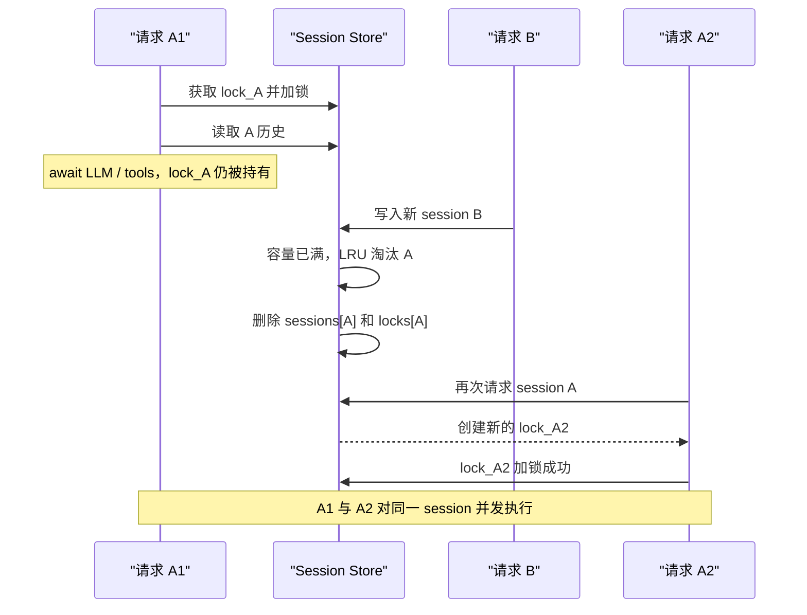

# Session Store 问题复习：并发淘汰与会话回忆契约

> 历史说明：本文主要复盘 V3.2 compact Turn/RequestRecord SessionStore 设计，其中
> `resolved_entities`、`response_summary` 默认历史和 stateful `/plan` 等内容不是当前正式
> Chat Run 合同。当前实现以 PostgreSQL 完整 user/assistant transcript、Redis
> `RecentDialogueWindow`、请求级 `conversation.history_lookup` 和统一的
> `direct_answer` 为准。当前 direct answer 由模型结合真实 user/assistant
> 历史直接生成，不要求 response mode 或 turn-index basis。参见
> [`../design/architecture/ConversationMemory层.md`](../design/architecture/ConversationMemory层.md)。

> 面试复习主题：per-session lock、同 key 串行化、LRU 生命周期、锁对象稳定性、
> 单进程与分布式并发边界，以及基于历史 Turn 的会话回忆契约。

本文把项目中遇到的两类 Session Store 相关问题放在一起复习：

- 第 1～9 章：Session 锁、等待者和 LRU 淘汰之间的并发一致性问题。
- 第 10 章：Session Store 已正确保存并读取 Turn，但 Controller 的会话回忆输出契约与模型实际输出不兼容的问题。

前者发生在“历史数据如何安全地存取”，后者发生在“取到历史后，系统如何安全地解释并回答”。它们属于同一条会话链路，但故障层不同。

## 1. 背景

多轮对话服务通常按 `session_id` 保存最近若干轮历史：

```text
读取历史 -> 调用 LLM / 工具 -> 生成回答 -> 追加本轮摘要
```

同一个 session 的下一轮必须看到上一轮已经提交的结果。例如：

```text
第 1 轮：对手选 Lina，我选什么克制？
第 2 轮：那五号位呢？
```

第 2 轮里的“那”依赖第 1 轮。因此，同一 session 的一次请求不是简单的独立读写，
而是一个包含异步计算的读—改—写事务：

```text
history = store.get(session_id)
result = await run_agent(history, query)
store.append(session_id, summarize(result))
```

不同 session 之间没有这个顺序依赖，应当继续并发执行。常见设计因此不是一把全局锁，
而是每个 session 一把锁：

```text
session A: A1 -> A2 -> A3 串行
session B: B1 -> B2 串行

A 与 B 之间仍可并行
```

## 2. 使用场景

per-key / per-session lock 不只用于聊天系统，也常见于：

- 同一用户的余额、积分或配额更新。
- 同一订单的状态机迁移。
- 同一文档的版本更新。
- 同一设备的命令下发。
- 同一游戏房间或协作房间的事件处理。
- 同一缓存 key 的防击穿加载。
- 同一 session 的多轮 Agent、工作流或表单处理。

共同特征是：

1. 同一个 key 的操作有先后依赖。
2. 不同 key 应保持并行度。
3. 操作中间可能包含 `await`，因此普通字典操作的原子性不够。

## 3. 为什么只给 `append()` 加锁不够

假设同一 session 同时收到两个请求：

```text
已有历史：第 1 轮

请求 A：那四号位呢？
请求 B：那五号位呢？
```

如果只在 `append()` 时加锁，可能出现：

```text
A 读取：第 1 轮
B 读取：第 1 轮
A 计算
B 计算
A 加锁并写入第 2 轮
B 加锁并写入第 3 轮
```

虽然序号没有重复，但 B 的计算没有看到 A，仍然基于旧快照。这叫丢失上下文或会话分叉。

所以需要锁住完整事务：

```python
lock = await store.get_lock(session_id)
async with lock:
    history = await store.get(session_id)
    result = await runner.run(history, query)
    await store.append(session_id, summarize(result))
```

这里把耗时的 LLM 和工具调用也放在锁内是有意的。通常不建议长时间持锁，但本场景要求
同一 session 具有线性顺序；如果把计算移到锁外，就会重新产生分叉。可以通过请求超时、
队列长度限制和取消处理控制长临界区的代价。

## 4. 常见 bug

### 4.1 Check-then-act 竞态

```python
if session_id not in locks:
    locks[session_id] = asyncio.Lock()
return locks[session_id]
```

在单事件循环且代码段中没有 `await` 时，这段通常不会在中间被协程切走。但一旦实现迁移到
多线程、多事件循环、远程存储，或者创建过程本身出现 `await`，就需要额外保护 lock registry。
不要把当前运行模型下的偶然安全误认为通用安全。

### 4.2 锁表内存泄漏

每个新 `session_id` 都创建一个 lock，但失败、取消或从未写入数据的请求可能留下孤儿锁：

```text
locks 中有 session
sessions 中没有 session
```

只按照数据 session 的 LRU 淘汰不能清理这些孤儿锁。高并发随机 session ID 或大量取消请求
会让锁表突破 `max_sessions` 上限。

### 4.3 淘汰正在使用的锁

LRU 为了限制内存，会删除最久未使用的 session。如果淘汰逻辑不检查 session 是否正在使用，
可能删除一个仍被请求持有的 lock。

### 4.4 只检查 `lock.locked()`，忽略等待者

`locked()` 只能说明调用瞬间锁是否被持有，不能作为完整生命周期协议：

- 锁可能有等待队列。
- 释放与下一位等待者获得锁之间存在调度窗口。
- 淘汰逻辑和锁 registry 可能不在同一个同步边界里。

更稳妥的办法是维护显式的 `in_use` 引用计数，覆盖正在持锁和等待锁的请求。

### 4.5 异常或取消后没有释放锁

手写：

```python
await lock.acquire()
result = await runner.run(...)
lock.release()
```

如果中间抛异常或任务被取消，`release()` 不会执行。应使用：

```python
async with lock:
    ...
```

或至少使用 `try/finally`。

### 4.6 锁粒度错误

- 全局锁：正确但吞吐量差，所有 session 相互阻塞。
- 只锁单次写入：无法保证读—计算—写的会话一致性。
- per-session 完整事务锁：本场景的合理默认值。

### 4.7 误以为 `asyncio.Lock` 能跨进程

`asyncio.Lock` 只保护当前进程、当前事件循环中的协程。启动多个 Uvicorn worker 后：

```text
worker 1 有一把 session A 的锁
worker 2 也有另一把 session A 的锁
```

两者互不认识。多 worker 需要 Redis/Postgres 等共享状态，以及分布式锁、数据库事务、
乐观并发控制或按 key 分区的消息队列。

## 5. 本次仓库问题

### 5.1 原始设计

本次 Phase 1 使用：

- `OrderedDict[str, SessionData]` 保存 session，并实现 LRU。
- `dict[str, asyncio.Lock]` 保存 per-session lock。
- `PlanService` 在 lock 内完成 `get -> runner.run -> append`。
- 达到 `max_sessions` 时，删除最旧 session，同时删除同名 lock。

核心代码语义相当于：

```python
def evict_if_full():
    while len(sessions) >= max_sessions:
        session_id, _ = sessions.popitem(last=False)
        locks.pop(session_id, None)
```

### 5.2 出问题的原因

LRU 的“最久未使用”只反映字典访问顺序，不代表“当前没有请求正在使用”。

一次 session 请求在读取历史后会长时间 `await runner.run(...)`。在这段时间里，它仍持有
session lock，但 LRU 可能认为它足够旧并将它淘汰。淘汰逻辑随后把仍处于 locked 状态的
lock 从 registry 删除。

旧 lock 对象并不会因为从字典删除而消失：正在运行的协程还持有它。但后续请求查不到旧对象，
会为同一个 `session_id` 创建一把新 lock。于是同一个 session 同时存在两把互不关联的锁。

### 5.3 触发时序



复现结果体现为：

```text
旧 lock 仍处于 locked 状态
registry 返回的新 lock 与旧 lock 不是同一个对象
新 lock 处于 unlocked 状态
session A 的历史已经丢失
```

### 5.4 被破坏的不变量

正确实现应维护以下不变量：

1. 同一 session 的所有请求使用同一个有效锁对象。
2. 正在使用或等待使用的 session 不能被淘汰。
3. 同一 session 的第 N 轮必须看到前 N-1 轮已经提交的状态。
4. `turn_index` 在 session 生命周期内单调且不重复。
5. session 与锁的生命周期必须一致，不产生孤儿锁或无锁 session。
6. `max_sessions` 的容量策略不能以破坏并发正确性为代价。

## 6. 修复方式

### 6.1 最小修补

淘汰时跳过正在 locked 的 session：

```python
for session_id in lru_order:
    lock = locks.get(session_id)
    if lock is not None and lock.locked():
        continue
    evict(session_id)
    break
```

如果没有可安全淘汰的 session：

- 临时允许超过容量；或
- 拒绝创建新 session，并返回明确的容量错误。

不能为了严格维持一个软内存上限而破坏 session 一致性。

这个方案适合快速止血，但 `locked()` 无法完整表达等待者和生命周期，不是最稳健方案。

### 6.2 推荐方案：统一 Session Slot 生命周期

将数据、锁和使用计数放到同一个 slot：

```python
@dataclass
class SessionSlot:
    turns: list[Turn] = field(default_factory=list)
    next_turn_index: int = 1
    lock: asyncio.Lock = field(default_factory=asyncio.Lock)
    in_use: int = 0  # 持有者 + 等待者
```

Store 暴露事务上下文，而不是让调用者分别拿锁、读取和追加：

```python
async with store.session_transaction(session_id) as session:
    history = session.get(history_window)
    result = await runner.run(history, query)
    session.append(summarize(result))
```

`session_transaction()` 的关键步骤：

1. 在 registry/catalog 同步边界内查找或创建 slot。
2. 在等待 per-session lock 之前增加 `in_use`，这样等待者也受保护。
3. 获取 slot 自己的 lock。
4. 执行完整会话事务。
5. 在 `finally` 中释放并减少 `in_use`。
6. LRU 只淘汰 `in_use == 0` 的 slot。
7. session、lock、计数一起淘汰，不保留孤儿对象。

伪代码：

```python
@asynccontextmanager
async def session_transaction(self, session_id: str):
    async with self._catalog_lock:
        slot = self._get_or_create_slot(session_id)
        slot.in_use += 1

    try:
        async with slot.lock:
            yield slot
    finally:
        async with self._catalog_lock:
            slot.in_use -= 1
            self._evict_idle_slots_if_needed()
```

这里的 `in_use` 在等待锁之前增加，因此既保护当前持有者，也保护排队等待者。

### 6.3 容量满且全部 session 活跃时怎么办

有三种常见策略：

| 策略 | 优点 | 缺点 |
|---|---|---|
| 临时超出容量 | 不破坏正确性，实现简单 | 峰值内存可能高于配置 |
| 拒绝新 session | 内存上界严格 | 需要定义可重试错误和客户端行为 |
| 等待空闲 slot | 上界严格且不丢数据 | 容易形成排队和延迟扩散 |

Phase 1 通常优先“临时超限 + 指标告警”，因为 `max_sessions` 是资源保护策略，
而会话顺序是正确性约束。正确性约束优先级更高。

### 6.4 Phase 2：多进程与分布式方案

进程内 slot 只能解决单 worker。多 worker 可选择：

#### Redis 分布式锁

- 使用唯一 owner token。
- 锁要有 TTL，避免进程崩溃后永久占用。
- 长任务需要续租。
- 解锁时必须校验 owner token。
- 更严格的系统需要 fencing token，防止锁过期后的旧 owner 继续写入。

#### 乐观并发控制

```text
读取 history + version
执行计算
CAS: 只有 version 未变化才 append
冲突则重试、重新规划或返回冲突
```

优点是不长期持有分布式锁；缺点是 LLM/工具调用昂贵，冲突后重新计算成本高。

#### 按 session 分区的消息队列或 Actor

让同一个 `session_id` 始终路由到同一串行消费者。顺序语义清晰，适合高吞吐工作流，
但基础设施和故障恢复设计更复杂。

## 7. 测试清单

### 7.1 基础正确性

- 同一 session 的连续 append 得到唯一、递增的 `turn_index`。
- 裁剪旧 turn 后计数器不重置。
- 不同 session 的历史相互隔离。
- `get(limit)` 返回最新 N 轮，且保持时间正序。

### 7.2 并发正确性

- 同一 session 的两个请求必须串行。
- 第二个请求必须看到第一个请求提交的历史。
- 不同 session 可以同时执行。
- runner 抛异常或任务取消后，锁可以被下一请求获得。

### 7.3 LRU 与生命周期

- 普通 LRU 淘汰顺序正确。
- 正在持锁的 session 不被淘汰。
- 等待锁的 session 不被淘汰。
- 淘汰 session 时同时清理其锁和计数。
- 请求在创建锁后、写入 session 前失败，不留下孤儿锁。
- 全部 session 活跃且容量满时，行为符合选定策略。

### 7.4 多 worker 边界

- 文档明确进程内锁不提供跨 worker 保证。
- 如果部署允许多个 worker，启动检查或配置应阻止误用内存 session store。

## 8. 面试回答模板

### 问：为什么使用 per-session lock，而不是全局锁？

答：同一 session 的多轮请求有读—计算—写顺序依赖，需要串行；不同 session 没有共享状态，
可以并行。全局锁虽然简单，但会让所有用户互相阻塞，降低吞吐量。

### 问：为什么锁要覆盖 LLM 调用？

答：如果只锁写入，两个请求会读取同一份旧历史并分别计算，形成会话分叉。为了让第二个请求
看到第一个请求的结果，临界区必须覆盖 `get -> run -> append`。代价是同一 session 的请求会
排队，因此要配合超时、限流和监控。

### 问：本次 bug 的本质是什么？

答：数据使用了 LRU 生命周期，锁使用了独立 registry 生命周期。LRU 能淘汰一个仍在执行的
session 并删除其锁映射，后续请求会为同一 session 创建第二把锁。两把锁互不排斥，破坏了
同 session 串行化。根因是资源生命周期没有统一，且淘汰条件只考虑“旧”，没有考虑“正在使用”。

### 问：为什么仅检查 `lock.locked()` 还不够？

答：它只能看到瞬时持锁状态，不能可靠表达等待者和整个生命周期。推荐为 session slot 维护
显式 `in_use` 计数，在等待锁之前增加，在请求完成的 `finally` 中减少；LRU 只淘汰
`in_use == 0` 的 slot。

### 问：`asyncio.Lock` 能用于多 worker 吗？

答：不能。它只在单进程、单事件循环中有效。多 worker 需要分布式锁、数据库事务、CAS，
或按 session key 串行消费的队列/Actor。

## 9. 一句话记忆

> per-session lock 解决的是同 key 顺序；LRU 解决的是资源上限。淘汰策略必须服从并发正确性，
> 数据、锁、等待者和生命周期必须作为一个整体管理。

---

## 10. 会话回忆契约问题：Session Store 正常，但回答仍然失败

### 10.1 问题定位

这次问题最容易出现的误判是：

> 第二轮没有正确回答第一轮谈到的英雄，所以 Session Store 的记忆功能坏了。

但实际排查结果是：

- 第一轮 Turn 已经成功写入 Session Store；
- 第二轮使用了同一个 `session_id`；
- Session Store 成功读取历史，日志中可以看到 `history_turns=1`；
- 失败发生在读取历史之后的 Controller 决策校验阶段。

因此，这不是 Session Store 的读写、锁或淘汰问题，而是一个 **Controller 契约适配问题**：模型为 direct recall 生成了自由文本 `answer`，而系统要求这类回答必须由服务端根据 `ConversationBasis` 确定性渲染。

一句话概括：

> **记忆没有丢，Controller 也找到了历史；真正失败的是模型输出格式违反了回忆契约。**

### 10.2 完整会话链路中的职责边界

会话记忆不是一个单独组件完成的，而是一条分层链路：

```text
客户端复用 session_id
        ↓
Session Store 读取最近 Turn
        ↓
历史写入当前 state.history
        ↓
Controller 判断是回忆、闲聊还是工具计划
        ↓
回忆时生成 ConversationBasis
        ↓
校验 basis 是否真的可以引用对应 Turn 字段
        ↓
conversation_answer_node 按确定性模板生成答案
        ↓
本轮结果追加为新的 Turn
```

每一层承担的责任不同：

| 层次 | 核心责任 | 不应承担的责任 |
|---|---|---|
| Session Store | 按 `session_id` 保存、读取 Turn，保证同会话事务顺序和生命周期安全 | 判断用户意图、生成自然语言答案 |
| Controller | 判断当前问题需要回忆、闲聊还是工具调用；选择允许引用的历史字段 | 把模型自由文本直接当作可信回忆结果 |
| `ConversationBasis` 校验 | 验证模型引用的 Turn 和字段真实、可用且符合隐私约束 | 猜测模型“可能想引用什么” |
| `conversation_answer_node` | 根据已验证的 basis 确定性读取 Turn 并渲染回答 | 重新让模型自由发挥或覆盖历史事实 |

这个分层很重要：Session Store 能保证“历史还在”，但不能自动保证“模型正确引用历史”。

### 10.3 `ConversationBasis` 的设计含义

direct recall 不允许模型凭记忆自由回答，只允许它声明：

> 我要引用当前 `state.history` 中哪一个 Turn 的哪一个字段。

当前允许的 basis 主要包括：

- `query`：用户当时问了什么；非空时可引用。
- `resolved_entities`：当时成功确认的英雄、战队或玩家实体；只允许引用满足状态和内容约束的值。
- `response_summary`：当时回答的摘要；空摘要或需要脱敏的失败 Turn 不得引用。

例如第一轮：

```text
enemy picked Lina, what should I pick?
```

第二轮：

```text
我上次问的是哪个英雄？
```

Controller 正确的决策语义不是直接写出“Lina”，而是类似：

```json
{
  "kind": "direct_answer",
  "response_mode": "recall_entity",
  "basis": [
    {
      "turn_index": 1,
      "field": "resolved_entities",
      "entity_kind": "hero"
    }
  ],
  "answer": null
}
```

随后由服务端读取真实 Turn，确定性生成“你上次问的是 Lina”。

这里的 `basis` 类似数据库查询条件或引用凭证，`answer` 则是查询结果。模型可以帮助选择查询条件，但不能自己伪造查询结果。

### 10.4 本次 Bug 的表现和根因

模型实际返回了合法的 recall 类型和 basis，同时又多返回了一段自由文本 `answer`。例如：

```json
{
  "kind": "direct_answer",
  "response_mode": "recall_entity",
  "basis": [
    {
      "turn_index": 1,
      "field": "resolved_entities",
      "entity_kind": "hero"
    }
  ],
  "answer": "你上次问的是 Lina。"
}
```

旧校验器为了保证回忆结果不被模型覆盖，会拒绝非空 `answer`：

```text
conversation recall answer must be rendered deterministically
```

校验失败后虽然会重试，但旧重试提示只说明“必须确定性渲染”，没有直接告诉模型：

```text
请把 answer 设置为 JSON null
```

于是模型可能在多次重试中继续返回同一种结构，最终整个 Controller 决策失败。

根因可以拆成三层：

1. **Schema 复用带来的语义差异**：direct recall 和 social 都使用 direct answer 决策，但两种模式对 `answer` 的要求相反；recall 必须为空，social 则需要自由文本。
2. **提示词不能提供强约束保证**：即使 prompt 写了规则，模型也可能按照自然语言习惯补全一个看起来合理的答案。
3. **校验只会拒绝，没有先消除无权威字段**：对 recall 来说，自由 `answer` 本来就不会被使用。直接拒绝整个结构，会把一个可以安全修正的格式偏差升级成业务失败。

### 10.5 为什么正确修复是“清除 answer”，而不是“信任 answer”

有三种直觉上的处理方式：

#### 方式 A：直接使用模型返回的 `answer`

不可取。模型可能说“Shadow Fiend”，而 basis 实际引用的是历史中的 Lina。如果直接使用自由文本，就绕过了 `ConversationBasis` 的真实性校验，确定性回忆形同虚设。

#### 方式 B：只要 `answer` 非空就一直重试

安全但脆弱。它把模型常见的格式冗余当作不可恢复错误，增加延迟和调用成本，而且不能保证下一次模型一定遵守。

#### 方式 C：清除 recall 的自由 `answer`，再严格校验 basis

这是本次采用的方式：

- recall 模式下，无条件把 `answer` 规范化为 `null`；
- social 模式下，继续保留模型自由文本；
- basis 仍然严格校验，不能引用不存在、越界、空值或不允许的历史字段；
- 最终答案只由确定性节点读取真实 Turn 生成。

这样处理并不是宽松 fallback，也不是掩盖错误。它只删除一个在 recall 模式下本来就没有权威性的字段，不会伪造 basis，也不会把缺失上下文变成成功答案。

### 10.6 修复方式：提示词、规范化、校验和渲染四层防线

#### 第一层：在 Controller 提示词中明确模式差异

规则必须直接、可执行：

```text
recall:
- basis 必须非空
- answer 必须是 JSON null
- 最终回答由服务端渲染

social:
- basis 必须为空
- answer 必须包含自由文本
```

这能减少模型输出偏差，但不能作为唯一保障。

#### 第二层：Controller 解析后统一规范化

核心规则可以概括为：

```python
if decision.kind == "direct_answer":
    if decision.response_mode != "social":
        decision.answer = None
```

规范化应当满足幂等性：执行一次和执行多次结果相同，便于在多个边界安全调用。

#### 第三层：图运行时再次规范化

不能只在默认 Controller 实现中修复，因为测试替身、自定义 Controller 或未来的新入口可能绕过它。

因此在 `decision_validate_node` 中再次执行同一规范化，再把规范化后的 decision、kind 和 plan 写入 graph state。这样可以保证任何进入后续节点的 recall 决策都满足同一不变量。

#### 第四层：basis 继续严格校验，回答继续确定性渲染

清除 `answer` 后仍要检查：

- `turn_index` 是否存在；
- 指定字段是否允许引用；
- entity 类型是否匹配；
- `resolved_entities` 是否满足成功和非空条件；
- `response_summary` 是否为空或来自不允许暴露的失败 Turn；
- social 是否错误携带 basis；
- recall 是否缺少 basis。

校验成功后，`conversation_answer_node` 只读取已验证字段。即使模型原先自由回答的是另一个英雄，最终结果仍必须以真实 Turn 为准。

### 10.7 修复后的关键不变量

这次修复建立了以下不变量：

1. recall 的自由 `answer` 永远不能成为最终答案来源；
2. social 可以保留自由 `answer`，但 basis 必须为空；
3. recall 必须有非空且校验通过的 basis；
4. 规范化不能把非法 basis 修成合法 basis；
5. 确定性回答节点只能读取当前 `state.history`，不能跨 Session Store 全局检索；
6. 历史只是非可信上下文，不自动升级为当前问题的外部事实证据；
7. 被丢弃的模型自由回答不应写入普通日志，避免错误内容或敏感内容泄漏；
8. 无 session、无历史或引用越界时，系统应明确返回上下文缺失或校验错误，不能编造答案。

### 10.8 与“锁和 LRU 淘汰 Bug”的区别与联系

| 对比项 | 锁与 LRU 淘汰问题 | 会话回忆契约问题 |
|---|---|---|
| 故障层 | Session Store 生命周期和并发控制 | Controller 决策与回答契约 |
| 数据是否写入 | 可能因双锁或错误淘汰而丢失 | 已正确写入 |
| 历史是否读到 | 可能读不到或读到断裂历史 | 已正确读到，`history_turns` 正常 |
| 典型症状 | 同 session 乱序、lost update、等待者拿到新锁 | decision validation 重试失败 |
| 根因 | 数据、锁、等待者生命周期没有统一管理 | 模型自由输出与确定性 recall 契约不匹配 |
| 修复重点 | lease、holder、单一锁对象、原子事务、不可淘汰活跃会话 | 清除非权威 answer、严格 basis、确定性渲染 |

二者的共同设计经验是：

> **系统不变量不能交给不可靠的参与者自觉维护。**

- 在并发问题中，不能靠 LRU 淘汰逻辑“碰巧不删到等待者”；必须用 lease 等状态明确禁止。
- 在模型契约问题中，不能靠 prompt 保证模型“每次都记得填 null”；必须由代码规范化并校验。

### 10.9 direct recall 与上下文继承工具查询不是一回事

#### 用例一：“我上次问的是哪个英雄？”

这是 direct recall：

```text
读取 Turn
  → Controller 选择 resolved_entities basis
  → 服务端确定性回答 Lina
```

不需要调用 STRATZ，也不需要把历史内容构造成 evidence。

#### 用例二：“她最近的胜率怎么样？”

这里的“她”虽然通过历史解析为 Lina，但“最近胜率”是当前的外部数据问题，不是简单复述历史。

正确路径是：

```text
历史帮助理解“她”指 Lina
  → Controller 生成 tool_plan
  → 当前轮重新 resolve_hero 确认实体
  → 调用 stratz.hero_daily_trends 等实时工具
  → 生成当前证据
  → 根据当前证据回答胜率
```

历史中的 Lina 只用于消歧和继承语境，不能直接当作实时胜率的证据。这样可以防止历史注入、实体串线和陈旧数据被误当成当前事实。

### 10.10 排查方法：不要只看最终回答

调试多轮会话时，应按层检查：

1. 请求是否复用了同一个 UUID v4 `session_id`；
2. 第一轮响应是否成功，Turn 是否确实追加；
3. 第二轮日志中的 `history_turns` 是否大于 0；
4. 失败发生在 Session Store、Controller、decision validation、tool executor 还是 answer node；
5. Controller 返回的 `kind`、`response_mode`、basis 数量是否符合预期；
6. recall 的 `answer` 是否已被规范化为 `null`；
7. basis 指向的 Turn、字段和 entity kind 是否真实可用；
8. 最终答案是否来自真实 Turn，而不是模型原始自由文本。

特别注意：HTTP 返回 `200 OK` 只说明接口成功返回了业务响应，不代表内部 agentic workflow 一定成功。应同时查看响应中的业务状态、错误对象、trace 和服务端日志。

### 10.11 测试清单

#### Session Store 和基础链路

- 第一轮使用新 session，成功追加一个包含 Lina 实体的 Turn；
- 第二轮复用同一个 session，能够读取 `history_turns=1`；
- 不同 session 之间不能读取彼此历史；
- 不传 `session_id` 时保持无状态行为。

#### recall 契约

- 模型返回正确 basis 且 `answer=null`，正常回答；
- 模型返回正确 basis 但 `answer` 非空，规范化后仍正常回答；
- 模型自由回答写成 Shadow Fiend、basis 指向 Lina，最终必须回答 Lina；
- 对同一 decision 重复规范化，结果保持不变；
- `turn_index` 越界仍然失败；
- recall 缺少 basis 仍然失败；
- `resolved_entities` 不满足引用条件时仍然失败；
- 空摘要或受限制失败 Turn 的摘要不能被引用；
- social 保留自由文本，但携带 basis 时必须失败；
- 无历史时不能编造“上次问过的英雄”；
- recall 不应误走工具调用、evidence 或 critic 链路；
- 日志不应打印被丢弃的自由回答内容。

#### 上下文继承工具查询

- 第一轮谈 Lina，第二轮问“她最近的胜率”，应解析为 Lina；
- 第二轮仍须在当前计划中确认实体并调用实时数据工具；
- 工具失败时应暴露真实上游错误，不能退化为历史猜测；
- 历史中的实体 ID 不得直接冒充当前轮 evidence。

### 10.12 面试回答模板

#### 30 秒版本

> 我们的多轮记忆分成存储和消费两层。Session Store 负责安全保存和读取 Turn，Controller 负责选择允许引用的历史字段。一次 Bug 中，Store 已经正确读到历史，但模型在 direct recall 决策里额外返回了自由 answer，违反了服务端确定性渲染契约，导致校验反复失败。修复不是信任模型 answer，而是在 Controller 和图校验边界幂等地把 recall answer 清为 null，同时继续严格校验 ConversationBasis，最后由服务端读取真实 Turn 生成答案。这样既兼容模型常见的格式偏差，又不降低事实和隐私边界。

#### 追问：“为什么不只改 prompt？”

> Prompt 是软约束，模型仍可能生成语义合理但格式多余的字段。只改 prompt 不能建立系统不变量，所以 prompt 用于降低偏差，代码规范化和校验用于提供确定性保证。

#### 追问：“清除字段算不算掩盖错误？”

> 不算。recall 的自由 answer 本来就没有权威性，删除它不会改变业务语义。真正有权威性的是 basis，basis 仍然严格校验；如果 Turn 不存在、字段不可引用或上下文缺失，系统仍会明确失败。

#### 追问：“这和 Session Store Bug 有什么关系？”

> 它们在同一条会话链路上，但层次不同。锁和 LRU Bug 会让 Turn 真正丢失或乱序；这次契约 Bug 中 Turn 完整存在，只是在 Controller 消费历史时失败。排查时应先确认历史是否写入和读到，再沿 Controller、校验和渲染节点逐层定位。

### 10.13 一句话记忆

> **Session Store 保证“历史还在且顺序正确”，ConversationBasis 保证“只能引用允许的历史”，确定性回答节点保证“最终说的是历史真实内容”；模型只负责选择，不负责篡改回忆结果。**
