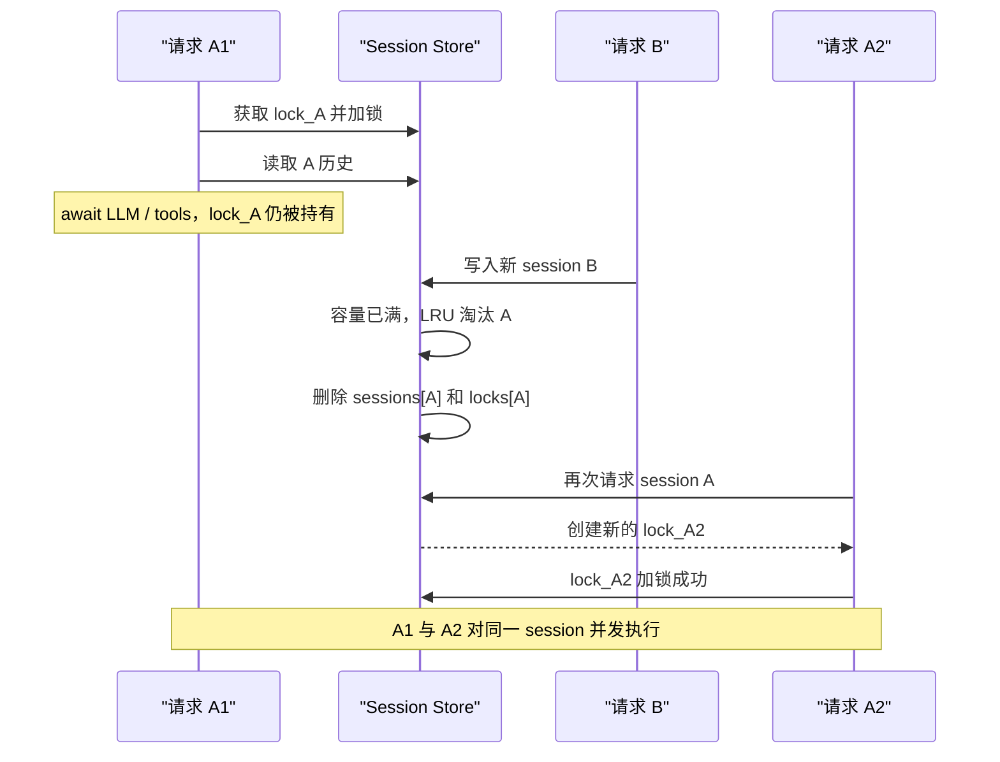

# Session 锁与 LRU 淘汰并发问题

> 面试复习主题：per-session lock、同 key 串行化、LRU 生命周期、锁对象稳定性、
> 单进程与分布式并发边界。

## 1. 背景

多轮对话服务通常按 `session_id` 保存最近若干轮历史：

```text
读取历史 -> 调用 LLM / 工具 -> 生成回答 -> 追加本轮摘要
```

同一个 session 的下一轮必须看到上一轮已经提交的结果。例如：

```text
第 1 轮：对手选 Lina，我选什么克制？
第 2 轮：那五号位呢？
```

第 2 轮里的“那”依赖第 1 轮。因此，同一 session 的一次请求不是简单的独立读写，
而是一个包含异步计算的读—改—写事务：

```text
history = store.get(session_id)
result = await run_agent(history, query)
store.append(session_id, summarize(result))
```

不同 session 之间没有这个顺序依赖，应当继续并发执行。常见设计因此不是一把全局锁，
而是每个 session 一把锁：

```text
session A: A1 -> A2 -> A3 串行
session B: B1 -> B2 串行

A 与 B 之间仍可并行
```

## 2. 使用场景

per-key / per-session lock 不只用于聊天系统，也常见于：

- 同一用户的余额、积分或配额更新。
- 同一订单的状态机迁移。
- 同一文档的版本更新。
- 同一设备的命令下发。
- 同一游戏房间或协作房间的事件处理。
- 同一缓存 key 的防击穿加载。
- 同一 session 的多轮 Agent、工作流或表单处理。

共同特征是：

1. 同一个 key 的操作有先后依赖。
2. 不同 key 应保持并行度。
3. 操作中间可能包含 `await`，因此普通字典操作的原子性不够。

## 3. 为什么只给 `append()` 加锁不够

假设同一 session 同时收到两个请求：

```text
已有历史：第 1 轮

请求 A：那四号位呢？
请求 B：那五号位呢？
```

如果只在 `append()` 时加锁，可能出现：

```text
A 读取：第 1 轮
B 读取：第 1 轮
A 计算
B 计算
A 加锁并写入第 2 轮
B 加锁并写入第 3 轮
```

虽然序号没有重复，但 B 的计算没有看到 A，仍然基于旧快照。这叫丢失上下文或会话分叉。

所以需要锁住完整事务：

```python
lock = await store.get_lock(session_id)
async with lock:
    history = await store.get(session_id)
    result = await runner.run(history, query)
    await store.append(session_id, summarize(result))
```

这里把耗时的 LLM 和工具调用也放在锁内是有意的。通常不建议长时间持锁，但本场景要求
同一 session 具有线性顺序；如果把计算移到锁外，就会重新产生分叉。可以通过请求超时、
队列长度限制和取消处理控制长临界区的代价。

## 4. 常见 bug

### 4.1 Check-then-act 竞态

```python
if session_id not in locks:
    locks[session_id] = asyncio.Lock()
return locks[session_id]
```

在单事件循环且代码段中没有 `await` 时，这段通常不会在中间被协程切走。但一旦实现迁移到
多线程、多事件循环、远程存储，或者创建过程本身出现 `await`，就需要额外保护 lock registry。
不要把当前运行模型下的偶然安全误认为通用安全。

### 4.2 锁表内存泄漏

每个新 `session_id` 都创建一个 lock，但失败、取消或从未写入数据的请求可能留下孤儿锁：

```text
locks 中有 session
sessions 中没有 session
```

只按照数据 session 的 LRU 淘汰不能清理这些孤儿锁。高并发随机 session ID 或大量取消请求
会让锁表突破 `max_sessions` 上限。

### 4.3 淘汰正在使用的锁

LRU 为了限制内存，会删除最久未使用的 session。如果淘汰逻辑不检查 session 是否正在使用，
可能删除一个仍被请求持有的 lock。

### 4.4 只检查 `lock.locked()`，忽略等待者

`locked()` 只能说明调用瞬间锁是否被持有，不能作为完整生命周期协议：

- 锁可能有等待队列。
- 释放与下一位等待者获得锁之间存在调度窗口。
- 淘汰逻辑和锁 registry 可能不在同一个同步边界里。

更稳妥的办法是维护显式的 `in_use` 引用计数，覆盖正在持锁和等待锁的请求。

### 4.5 异常或取消后没有释放锁

手写：

```python
await lock.acquire()
result = await runner.run(...)
lock.release()
```

如果中间抛异常或任务被取消，`release()` 不会执行。应使用：

```python
async with lock:
    ...
```

或至少使用 `try/finally`。

### 4.6 锁粒度错误

- 全局锁：正确但吞吐量差，所有 session 相互阻塞。
- 只锁单次写入：无法保证读—计算—写的会话一致性。
- per-session 完整事务锁：本场景的合理默认值。

### 4.7 误以为 `asyncio.Lock` 能跨进程

`asyncio.Lock` 只保护当前进程、当前事件循环中的协程。启动多个 Uvicorn worker 后：

```text
worker 1 有一把 session A 的锁
worker 2 也有另一把 session A 的锁
```

两者互不认识。多 worker 需要 Redis/Postgres 等共享状态，以及分布式锁、数据库事务、
乐观并发控制或按 key 分区的消息队列。

## 5. 本次仓库问题

### 5.1 原始设计

本次 Phase 1 使用：

- `OrderedDict[str, SessionData]` 保存 session，并实现 LRU。
- `dict[str, asyncio.Lock]` 保存 per-session lock。
- `PlanService` 在 lock 内完成 `get -> runner.run -> append`。
- 达到 `max_sessions` 时，删除最旧 session，同时删除同名 lock。

核心代码语义相当于：

```python
def evict_if_full():
    while len(sessions) >= max_sessions:
        session_id, _ = sessions.popitem(last=False)
        locks.pop(session_id, None)
```

### 5.2 出问题的原因

LRU 的“最久未使用”只反映字典访问顺序，不代表“当前没有请求正在使用”。

一次 session 请求在读取历史后会长时间 `await runner.run(...)`。在这段时间里，它仍持有
session lock，但 LRU 可能认为它足够旧并将它淘汰。淘汰逻辑随后把仍处于 locked 状态的
lock 从 registry 删除。

旧 lock 对象并不会因为从字典删除而消失：正在运行的协程还持有它。但后续请求查不到旧对象，
会为同一个 `session_id` 创建一把新 lock。于是同一个 session 同时存在两把互不关联的锁。

### 5.3 触发时序



复现结果体现为：

```text
旧 lock 仍处于 locked 状态
registry 返回的新 lock 与旧 lock 不是同一个对象
新 lock 处于 unlocked 状态
session A 的历史已经丢失
```

### 5.4 被破坏的不变量

正确实现应维护以下不变量：

1. 同一 session 的所有请求使用同一个有效锁对象。
2. 正在使用或等待使用的 session 不能被淘汰。
3. 同一 session 的第 N 轮必须看到前 N-1 轮已经提交的状态。
4. `turn_index` 在 session 生命周期内单调且不重复。
5. session 与锁的生命周期必须一致，不产生孤儿锁或无锁 session。
6. `max_sessions` 的容量策略不能以破坏并发正确性为代价。

## 6. 修复方式

### 6.1 最小修补

淘汰时跳过正在 locked 的 session：

```python
for session_id in lru_order:
    lock = locks.get(session_id)
    if lock is not None and lock.locked():
        continue
    evict(session_id)
    break
```

如果没有可安全淘汰的 session：

- 临时允许超过容量；或
- 拒绝创建新 session，并返回明确的容量错误。

不能为了严格维持一个软内存上限而破坏 session 一致性。

这个方案适合快速止血，但 `locked()` 无法完整表达等待者和生命周期，不是最稳健方案。

### 6.2 推荐方案：统一 Session Slot 生命周期

将数据、锁和使用计数放到同一个 slot：

```python
@dataclass
class SessionSlot:
    turns: list[Turn] = field(default_factory=list)
    next_turn_index: int = 1
    lock: asyncio.Lock = field(default_factory=asyncio.Lock)
    in_use: int = 0  # 持有者 + 等待者
```

Store 暴露事务上下文，而不是让调用者分别拿锁、读取和追加：

```python
async with store.session_transaction(session_id) as session:
    history = session.get(history_window)
    result = await runner.run(history, query)
    session.append(summarize(result))
```

`session_transaction()` 的关键步骤：

1. 在 registry/catalog 同步边界内查找或创建 slot。
2. 在等待 per-session lock 之前增加 `in_use`，这样等待者也受保护。
3. 获取 slot 自己的 lock。
4. 执行完整会话事务。
5. 在 `finally` 中释放并减少 `in_use`。
6. LRU 只淘汰 `in_use == 0` 的 slot。
7. session、lock、计数一起淘汰，不保留孤儿对象。

伪代码：

```python
@asynccontextmanager
async def session_transaction(self, session_id: str):
    async with self._catalog_lock:
        slot = self._get_or_create_slot(session_id)
        slot.in_use += 1

    try:
        async with slot.lock:
            yield slot
    finally:
        async with self._catalog_lock:
            slot.in_use -= 1
            self._evict_idle_slots_if_needed()
```

这里的 `in_use` 在等待锁之前增加，因此既保护当前持有者，也保护排队等待者。

### 6.3 容量满且全部 session 活跃时怎么办

有三种常见策略：

| 策略 | 优点 | 缺点 |
|---|---|---|
| 临时超出容量 | 不破坏正确性，实现简单 | 峰值内存可能高于配置 |
| 拒绝新 session | 内存上界严格 | 需要定义可重试错误和客户端行为 |
| 等待空闲 slot | 上界严格且不丢数据 | 容易形成排队和延迟扩散 |

Phase 1 通常优先“临时超限 + 指标告警”，因为 `max_sessions` 是资源保护策略，
而会话顺序是正确性约束。正确性约束优先级更高。

### 6.4 Phase 2：多进程与分布式方案

进程内 slot 只能解决单 worker。多 worker 可选择：

#### Redis 分布式锁

- 使用唯一 owner token。
- 锁要有 TTL，避免进程崩溃后永久占用。
- 长任务需要续租。
- 解锁时必须校验 owner token。
- 更严格的系统需要 fencing token，防止锁过期后的旧 owner 继续写入。

#### 乐观并发控制

```text
读取 history + version
执行计算
CAS: 只有 version 未变化才 append
冲突则重试、重新规划或返回冲突
```

优点是不长期持有分布式锁；缺点是 LLM/工具调用昂贵，冲突后重新计算成本高。

#### 按 session 分区的消息队列或 Actor

让同一个 `session_id` 始终路由到同一串行消费者。顺序语义清晰，适合高吞吐工作流，
但基础设施和故障恢复设计更复杂。

## 7. 测试清单

### 7.1 基础正确性

- 同一 session 的连续 append 得到唯一、递增的 `turn_index`。
- 裁剪旧 turn 后计数器不重置。
- 不同 session 的历史相互隔离。
- `get(limit)` 返回最新 N 轮，且保持时间正序。

### 7.2 并发正确性

- 同一 session 的两个请求必须串行。
- 第二个请求必须看到第一个请求提交的历史。
- 不同 session 可以同时执行。
- runner 抛异常或任务取消后，锁可以被下一请求获得。

### 7.3 LRU 与生命周期

- 普通 LRU 淘汰顺序正确。
- 正在持锁的 session 不被淘汰。
- 等待锁的 session 不被淘汰。
- 淘汰 session 时同时清理其锁和计数。
- 请求在创建锁后、写入 session 前失败，不留下孤儿锁。
- 全部 session 活跃且容量满时，行为符合选定策略。

### 7.4 多 worker 边界

- 文档明确进程内锁不提供跨 worker 保证。
- 如果部署允许多个 worker，启动检查或配置应阻止误用内存 session store。

## 8. 面试回答模板

### 问：为什么使用 per-session lock，而不是全局锁？

答：同一 session 的多轮请求有读—计算—写顺序依赖，需要串行；不同 session 没有共享状态，
可以并行。全局锁虽然简单，但会让所有用户互相阻塞，降低吞吐量。

### 问：为什么锁要覆盖 LLM 调用？

答：如果只锁写入，两个请求会读取同一份旧历史并分别计算，形成会话分叉。为了让第二个请求
看到第一个请求的结果，临界区必须覆盖 `get -> run -> append`。代价是同一 session 的请求会
排队，因此要配合超时、限流和监控。

### 问：本次 bug 的本质是什么？

答：数据使用了 LRU 生命周期，锁使用了独立 registry 生命周期。LRU 能淘汰一个仍在执行的
session 并删除其锁映射，后续请求会为同一 session 创建第二把锁。两把锁互不排斥，破坏了
同 session 串行化。根因是资源生命周期没有统一，且淘汰条件只考虑“旧”，没有考虑“正在使用”。

### 问：为什么仅检查 `lock.locked()` 还不够？

答：它只能看到瞬时持锁状态，不能可靠表达等待者和整个生命周期。推荐为 session slot 维护
显式 `in_use` 计数，在等待锁之前增加，在请求完成的 `finally` 中减少；LRU 只淘汰
`in_use == 0` 的 slot。

### 问：`asyncio.Lock` 能用于多 worker 吗？

答：不能。它只在单进程、单事件循环中有效。多 worker 需要分布式锁、数据库事务、CAS，
或按 session key 串行消费的队列/Actor。

## 9. 一句话记忆

> per-session lock 解决的是同 key 顺序；LRU 解决的是资源上限。淘汰策略必须服从并发正确性，
> 数据、锁、等待者和生命周期必须作为一个整体管理。
